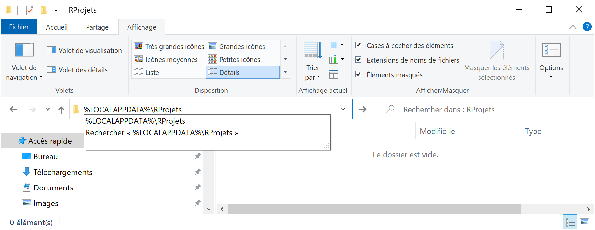

# Software {#chap-logiciels}

\toc{1}

The central tool is obviously R, but its operation is today difficult to consider without its development environment RStudio.
For source control, git and GitHub are the de facto standards.
The set must be completed by a LaTeX distribution for the production of documents in PDF format.
A bibliographic management tool is essential: Zotero and its extension Better BibTeX are perfectly adapted to the framework presented here.
Finally, other software of more occasional use may be necessary, such as Go.

Their installation and coherent organization are presented in this chapter.


## R

### Installation

R is included in Linux distributions: the package is named `r-base`.
It does not contain development tools that are often needed, so it is better to install the `r-base-dev` package as well.
The version of R is often a bit old.
To get the latest version, you have to use a CRAN mirror as a source for the packages: see the full documentation for Ubuntu[^102].

[^102]: https://doc.ubuntu-fr.org/r 

On Windows or Mac, install R after downloading it from CRAN[^101].

[^101]: https://cran.r-project.org/


### Rtools

On Mac, the installation of R is sufficient from version 4.0.0.

On Windows, the installation must be completed by the "Rtools", which contain the development tools, including those necessary to compile packages containing C++ code.

The path of the Rtools (before version 4.2) must be declared to R, by executing the following command in the RStudio console (adapted to version 4.0 of the Rtools):
```{r rtools, tidy=FALSE}
# Rtools : path declaration, 
# requires restarting RStudio
writeLines('PATH="${RTOOLS40_HOME}\\usr\\bin;${PATH}"',
           con = "~/.Renviron")
```

Since version 4.2, this action is unnecessary.

The Rtools must be completed by some missing utilities, to be installed when the need appears (usually a warning from R that the software is not installed).

Package checking returns a warning if *qpdf*[^110] is not installed.
Download the zip file and paste the entire contents of the `bin` folder into the `usr/bin` folder of `Rtools` (`C:\Rtools42\r\bin` for version 4.2).

[^110]: https://sourceforge.net/projects/qpdf/

Another warning is returned if *Ghostscript* is not available.
Download and install it[^111].
Then copy the contents of the `bin` folder to the `usr/bin` folder of `Rtools`.

[^111]: https://www.ghostscript.com/


### Update

It is recommended to use the latest minor version of R: for example, 4.0.x until the release of version 4.1.
It is mandatory to use the latest version to prepare a package submitted to CRAN.

Important changes occur between major versions (version 4 does not allow to use a package compiled for version 3) but also sometimes between minor versions (a binary data file `.rda` saved under version 3.3 cannot be read by version 3.6).
It is therefore useful to update R regularly.

Installing a new version does not automatically uninstall older versions, which allows you to use more than one version if necessary (for example, if an old and essential package is no longer available).
In common use, it is preferable to uninstall old versions manually after installing a new one.


### Libraries {#sec:librairies}

R packages are found in two folders:

* the *System Library* contains the packages that come with R: **base**, **utils**, **graphics** for example.
It is located in a subdirectory of the installation program (`C:\Program Files\R-4.1.0\library` for R version 4.1.0 on Windows 10).
* The *User Library* contains those installed by the user.
Until version 4.1, it is located in the user's home folder, in a subfolder `R\win-library\4.1\`).
Since version 4.2, this folder is in the user's local settings, whose folder location is in the environment variable `%LOCALAPPDATA%`.

Until version 4.1, if the user's home folder is backed up (for example, if it is replicated in the cloud by OneDrive on Windows), it is not optimal to place the packages there: the traffic generated by backing them up would be heavy and unnecessary.
In order for packages to be installed automatically in the system library, the user must have the right to write to it.
On Windows, give the computer's user group the "Modify" permission to the library folder, in addition to the default read permissions.
From version 4.2 onwards, there is no reason to change the default operation: local settings are not saved.

If the user library is selected, you must remember to empty the folder corresponding to the old version of R in case of minor version change.

The location of the libraries is given by the function `.libPaths()`:
```{r libPaths}
.libPaths()
```


## RStudio

RStudio is a graphical interface for R and much more: it is designed to simplify project management, make writing and publishing documents easier and integrate source control for example.

### Installation

Install the latest version of *RStudio Desktop* from the RStudio website[^103].

[^103]: https://rstudio.com/products/rstudio/download/

A command is available in the "Help" menu of RStudio to check for a more recent version to install.

### File encoding 

The files manipulated in R are mostly text files.
Special characters, especially accents, can be encoded in various ways, but the encoding declaration is not integrated in the files.
The default encoding depends on the operating system, which regularly causes problems with the readability of shared files.
The UTF8 encoding has become the standard because it is universally recognized and supports all alphabets without ambiguity.

The first time you use RStudio, create a new R file ("File > New File > R Script" menu), save it in UTF8 format ("File > Save with Encoding..."), choose UTF8 in the list of formats and check the box "Set as default encoding for source files".
Delete the file after saving it.

New files will be encoded in UTF8 format.
Files encoded in another format will not be displayed correctly: they can be reopened with their original encoding ("File > Reopen with Encoding..."), possibly trying several encodings until they are displayed correctly, and then saved in UTF8 format.

### Working folder

The default working folder is the user's home folder, called `~` by RStudio:

```{r R_USER}
Sys.getenv("R_USER")
```

- `My Documents` on Windows.
- `Home` on Mac or Linux.

You should always work in subfolders of `~`, for example: `~/Training`. 

For *RTools* to work properly, the full name of the working directory must not contain spaces (use underscores `_`) or special characters.
The current working directory is obtained by the command `getwd()`.

```{r getwd, eval=FALSE}
getwd()
```

Using source control (see chapter \@ref(chap-git)) creates many working files.
Source-controlled projects should not be located in a folder that is already backed up by another means, such as a OneDrive on Windows, otherwise resources will be used excessively: each change validation generates a backup of the modified files, but also of the control files, which can be very large.


### Solution chosen {#sec:solution-dossiers}

The organization of the work environment is a personal matter, depending on the preferences of each individual.
The organization proposed here is only a possibility, to be adapted to one's own choices, but respecting the constraints mentioned.

On Windows, an optimal organization is as follows:

* In one's personal folder (`My Documents`, `~` for R), an `R` folder is used for simple projects, without source control.
The backup of this folder is managed elsewhere.
* A folder outside the home folder is used for source-controlled projects. 
The user must have the right to write to it.
In the Windows organization, the folder corresponding to these criteria is `%LOCALAPPDATA%`, typically `C:\Users\Name\AppData`.
The folder will therefore be `%LOCALAPPDATA%\RProjects`.
To create it, run `md %LOCALAPPDATA%\RProjects` in a command prompt.
Pin this folder to the quick access of the file explorer (figure \@ref(fig:R-ProjetsR)): paste `%LOCALAPPDATA%\RProjects` in the address bar of the file explorer, validate, then right click on "Quick Access" and pin the folder.

(ref:R-ProjetsR) Folder for projects under source control, on Windows.
```{r R-ProjetsR, fig.cap="(ref:R-ProjetsR)", echo=FALSE, out.width='100%'}

```

### Character font

The Fira Code[^131] font provides ligatures: the "<-" characters used for assignment in R, for example, are displayed as an arrow.
To use it in the RStudio editor, simply install it according to the instructions for your operating system and declare it in the global options ("Tools > Global Options..." menu): select *Appearance* and the option *Editor Font*: Fira Code.

[^131]: https://github.com/tonsky/FiraCode


## Packages

### Installation from CRAN

The classic installation of packages uses CRAN.
There is an "Install" button in the *Packages* window of RStudio.

Packages are uploaded to CRAN by their authors as source code, compressed in a `.tar.gz` file. 
They are available for download as soon as they are validated.
They must then be put in binary format for Windows (in a `.zip' file), which takes some time.

When asked to install a package on Windows, CRAN proposes the source version rather than the binary version if it is more recent (figure \@ref(fig:R-BinaryPkg)).

(ref:R-BinaryPkg) Choice of the version of the packages to install.
```{r R-BinaryPkg, fig.cap="(ref:R-BinaryPkg)", echo=FALSE}
knitr::include_graphics('images/R-BinaryPkg.png')
```

The list of packages concerned is displayed in the console, for example:
```
  There are binary versions available but the source 
  versions are later:
              binary   source needs_compilation
boot          1.3-24   1.3-25             FALSE
class         7.3-16   7.3-17              TRUE
```
Some packages require compilation (column `needs_compilation`), usually because they contain C++ code.
They can only be installed by *Rtools*. 

The installation of packages in source version is much longer than in binary version.
Unless a specific version of a package is needed, it is better to refuse the installation of source versions.

Packages can be updated a little later, after they have been compiled by CRAN.

The "Update" button in the RStudio *Packages* window allows you to update all installed packages.


### Installation from GitHub

Some packages are not available on CRAN but only on GitHub because they are still under development or because they are not intended to be widely used by the R user community.
It can also be useful to install a development version of a package published on CRAN for a specific use like testing new features.

The installation is handled by the **remotes** package.
The `build_vignettes` argument is needed to create the vignettes of the package.

```{r install_github, eval=FALSE}
remotes::install_github("EricMarcon/memoiR", build_vignettes = TRUE)
```

The package name is entered as "GitHubID/PackageName".
The installation is done from the source code and therefore requires the Rtools if a build is needed.
`install_github()` checks that the version on GitHub is more recent than the version installed on the workstation and does nothing if they are identical.


### Installation from Bioconductor

Bioconductor is a complementary platform to CRAN that hosts packages specialized in genomics.
Installing packages from Bioconductor requires the **BiocManager** package for its `install()` function.
The first argument of the function is a vector of characters containing the names of the packages to be installed, for example:

```{r Bioconductor, eval=FALSE}
BiocManager::install(c("GenomicFeatures", "AnnotationDbi"))
```

The `install()` function called without arguments updates the packages.


### Selected solution

At each minor update of R, all packages must be reinstalled.
The most efficient way to do this is to create a `Packages.R` script to place in `~\R`.
It contains a function that checks if each package is already installed so that it is not redone unnecessarily.

```{r InstallPackages, eval=FALSE, tidy=FALSE}
# Install R packages ####

# Install packages if necessary ####
InstallPackages <- function(Packages) {
  sapply(Packages, function(Package) 
    if (!Package %in% installed.packages()[, 1]) 
      {install.packages(Package)})
}


# Development tools ####
InstallPackages(c(
  # Development tools. Import remotes, etc.
  "devtools",
  # Run Check by RStudio
  "rcmdcheck",
  # Formatting R code (used by knitr)
  "formatR",
  # Documentation of packages in /docs on GitHub
  "pkgdown",
  # Bibliography with roxygen
  "Rdpack",
  # Performance measurement
  "rbenchmark",
  # Automatic package documentation
  "roxygen2",
  # Package testing
  "testthat"
  ))

# Markdown ####
InstallPackages(c(
  # Knit
  "knitr",
  # Complex markdown documents
  "bookdown",
  # Websites
  "blogdown",
  # Document templates
  "memoiR"
  ))

# Tidyverse ####
InstallPackages("tidyverse")
```

The last part of the script is to be completed with the packages used regularly.

This script is to be executed each time R is updated, after having activated the right to write in the system library if needed (see section \@ref(sec:librairies)).


## git and GitHub

### git

git is the source control software used here.
Its use is detailed in the chapter \@ref(chap-git).

For Windows and Mac, the installation is done from the git website[^104].

[^104]: https://git-scm.com/

git is integrated in Linux distributions.
For Ubuntu, the apt package is `git-all`.

git is installed without a graphical interface, provided by RStudio.

In RStudio, modify the global options (menu "Tools > Global Options...").
Select *Terminal* and the option *New Terminals open with*: GitBash.

Check that git is installed correctly by typing the command `git -h` in the RStudio terminal: help should be displayed.

After installing git, the RStudio terminal may not work properly and return an error message containing the following:
```
*** fatal error - cygheap base mismatch detected
This problem is probably due to using incompatible 
versions of the cygwin DLL.
```
The error message is inaccurate: the library that should only exist in one copy is not `cygwin1.dll` but `msys-2.0.dll`.
Look for this file in the git and Rtools installation folders.
They are normally found in `usr/bin`.
Replace the git one by the Rtools one: the version of the two files must be identical.

Enter your credentials by running the following commands in the terminal:
```
git config user.name
git config user.email
```

The user name is free, preferably "FirstName LastName".

### GitHub

*GitHub* is the platform accessible through a [website](https://github.com/) that allows to share the content of *git* repositories.
To use it, you just have to open an account with the same email address as the one registered in git.

The name of the GitHub account is noted here *GitHubID*.
Each GitHub account allows to host repositories (a repository contains the files of a project) at the address https://github.com/GitHubID/RepoID[^107].
Each repository can have a website at https://GitHubID.github.io/RepoID/[^108].
Finally, a global web site is provided for each user at https://GitHubID.github.io/[^109].

[^107]: Example: https://github.com/EricMarcon/travailleR

[^108]: Example: https://EricMarcon.github.io/travailleR/

[^109]: Example: https://EricMarcon.github.io/


### SSH authentication {#sec:SSH}

Communication between git (installed on the local computer) and GitHub (online platform) requires authentication.

Two methods are available: HTTPS (also called SSL) and SSH.
SSH is the most robust but requires the creation of a private key.

In the RStudio terminal, run:
```
ssh-keygen -t ed25519 -C "user.email"
```

The email address (which replaces "user.email") must be the one registered in the git configuration and the GitHub account.
The key is saved in the `.ssh` folder of the user's home directory.
It is possible to add a passphrase to the key, which will have to be typed the first time each work session is used.
If the computer is properly secured (no physical access by third parties), leaving it empty allows to gain fluidity.

Warning: the private key is strictly confidential and must not be copied anywhere where it could be read by a third party (beware of automatic backups in particular).
It does not need to be well backed up: in case of loss, it will be easily replaced.

Keys are normally stored in the `~/.ssh` folder, regardless of the operating system, but the location of the `~` home folder is ambiguous on Windows: for R, it is the `Documents` folder, but for other software, it is the user's root folder, parent of `Documents`.

In the RStudio terminal, check that the key is working correctly:
```
ssh -T git@github.com
```

If an error message indicates that no key is found, there are two possible solutions:

- Duplicate the `.ssh` folder (with File Explorer) in `Documents`.
- Duplicate the `.ssh` folder in the RStudio program folder (usually `C:\Program Files\RStudio`), in `resourcesterminalbash`.

If successful, a message indicates that the authenticity of the GitHub server cannot be verified: a manual check is required for the first connection.
Check with GitHub that the server's fingerprint is correct[^112] and type `yes`.
The server is automatically added to the list of known servers, in the `known_hosts` file.

[^112]: https://docs.github.com/en/github/authenticating-to-github/githubs-ssh-key-fingerprints

In the `.ssh` folder, two files are created: one contains the private key, the other, with the `.pub` extension, the corresponding public key.
Open the second one with a text editor and copy the public key to the clipboard.
On GitHub, display the settings of your account ("Settings" menu), select "SSH and GPG Keys", click on "New SSH Key" and paste the key in the "Key" field.
Give a name to the key in the "Title" field.
The name can be the name of the computer on which the key was created.
The key must not be copied on several computers: if necessary, create a new key on each workstation used.

If the key is compromised (lost or loaned from the computer that contains it), delete it on GitHub and create a new one.

### Obtaining a personal access token {#sec:pat}

HTTPS authentication is the alternative to SSL authentication: choose a method and stick to it afterwards.
To use HTTPS authentication, the creation of a personal access token is required.

Tokens are created on GitHub, in the settings of one's user account, in "Developer Settings > Personal Access Tokens"[^ci-3].

[^ci-3]: <https://help.github.com/en/github/authenticating-to-github/creating-a-personal-access-token-for-the-command-line>

Generate a new token, describe it as "git-RStudio" and give it "repo" permission, i.e. modify *all* repositories (it is not possible to limit access to a particular repository).
The token is a string that cannot be read later: it must be saved as a password.


## LaTeX compiler

To produce documents in PDF format, a LaTeX distribution is needed.
The light solution is to install the **tinytex** package which in turn installs a LaTeX distribution optimized for R Markdown.

A full distribution allows the use of LaTeX beyond RStudio but is useless if the use of LaTeX is limited to knitting R Markdown documents.
MiKTeX is a very good solution for Windows and Mac.


### tinytex

Install the package and run it:

```{r install_tinytex, eval=FALSE}
install_tinytex()
```

Adding LaTeX packages not included in the minimal starting distribution is automatic but can be slow.

The distribution can be updated by the command:

```{r tlmgr_update, eval=FALSE}
tinytex::tlmgr_update()
```


### MiKTeX

#### Installation

Download the installation file[^105] and run it.
There are several choices to make during the installation:

* Install the program for all users (with administrator rights).
* The default paper size: choose A4.
* The installation mode of the missing packages: choose "Always Install" so that they are downloaded automatically if needed.

For Linux, follow the instructions on the MiKTeX website.

[^105]: https://miktex.org/download

#### Updates

MiKTeX is installed with the most used LaTeX packages.
If a document needs a missing package, it is loaded automatically.
Package updates should be done periodically with the MiKTeX console, accessible from the Start menu.

When launched without elevation of privileges, the console offers to switch to administrator mode.
Click on "Switch to Administrator mode".

In the settings, check that the packages always install automatically and that the paper size is A4.

In the "Updates" menu, click on "Check for updates" then "Update now".

If the automatic installation fails, it is possible to manually install a package in the "Packages" menu.


## Zotero {#sec:Zotero}

Zotero[^120] is the most used bibliographic management software.
Its extensions allow you to complete its functionalities according to your needs.
Better BibTeX allows you to export and maintain a selection of bibliographic references (a Zotero collection) as a BibTeX file in an R project, where it can be used in writing documents or documenting packages.

Download the installation file and run it.
Create a user account on the Zotero website.
Link the local installation to the account: in the "Edit > Preferences" menu, select "Sync > Settings" and authenticate in the "Data Syncing" area.
Then check the box "Sync automatically" but not "Sync full-text content" because the total size of full text synchronized in this way between the online Zotero account and the workstation is limited to 300 MB.

Download the Better BibTeX extension[^121] and install it with the "Tools > Add-ons" menu: click on the settings button at the top right of the window, then "Install Add-on From File..." and select the file just downloaded.

Set up Better BibTeX from the menu "Edit > Preferences > Better BibTeX".
The options to modify are the following:

- "Citation Keys > Citation Key Format": `auth:capitalize+year` so that citations have a unique identifier of the form "Name2021".
- "Citation Keys > Keep citation keys unique": "across all libraries" so that citation identifiers are not ambiguous.
- "Export > Fields > Fields to omit from export": "abstract, file" to avoid generating bibliographic files overweighted by useless information in R projects.

It is recommended to use the ZotMoov[^122] extension to better control the location of the full text (PDF files linked to bibliographic references).
Install it, then set its parameters in "Edit > Settings", "ZotMoov".
Choose the folder for storing full-text files in "Directory to Move Files To".
If the user's personal folder is backed up (for example, if it is replicated in the cloud by OneDrive on Windows), placing this storage folder there enables the full-text files to be backed up and accessed from several workstations or directly online.
This solution is much more efficient than Zotero's default synchronisation, which is limited in volume.

Then select the download folder in "Source Folder for Attaching New Files". 
The "ZotMoov: Attach New File" context menu will then automatically link the last file downloaded to the chosen reference.

Finally, in Zotero's advanced options ("Edit > Settings", "Advanced"), choose the base folder for linked attachments: this must be the same as the one chosen for storing full-text files.

[^120]: https://www.zotero.org/
[^121]: https://retorque.re/zotero-better-bibtex/installation/
[^122]: http://https://github.com/wileyyugioh/zotmoov/


## Go

Go[^106] is only used by the Hugo web site generator (see section \@ref(sec:blogdown)).

[^106]: https://golang.org/

Download the installation file and run it.
At the end of the installation, run the command `go version` in a terminal to check that it works.

Upgrades are done by installing the new version over the previous one.
