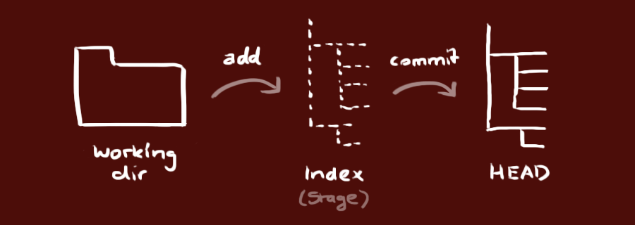

# Git and GitHub {#chap-git}

\toc{1}

Source control consists in recording all the modifications made on the tracked files.
The advantages are numerous: traceability and security of the project, possibility to collaborate efficiently, to go back, to try new developments without jeopardizing the stable version...


## Principles {#sec:principes-git}

### Source control {#sec:git-cds}

The standard tool today is *git*.

The git commands can be executed in the RStudio terminal.

(ref:git-Status) Screenshot of the RStudio terminal. The `git status` command, which is supposed to describe the state of the repository, returns an error if the R project is not under source control.
```{r git-Status, fig.cap="(ref:git-Status)", echo=FALSE}
knitr::include_graphics('images/git-Status.png')
```

The `git status` command (figure \@ref(fig:git-Status)) returns the status of the repository (*repository*), that is, the set of data managed by git to track the current project.

RStudio integrates a graphical interface for git that is sufficient to do without the command line for standard use, presented here.

### git and GitHub

*git* is the software installed on the workstation.

*GitHub* is a platform, accessible via the web[^314], which allows to share the content of git repositories (to work with several people) and to share documentation in the form of a web site (*GitHub Pages*).

[^314]: https://github.com/

As GitHub allows at least the backup of git repositories, the two are always used together.
GitHub is not the only platform that can be used but the main one.
Alternatives are Bitbucket[^309] and GitLab[^310] for example.

[^309]: https://bitbucket.org/

[^310]: https://about.gitlab.com/


## Create a new repository {#sec:creerdepot}

### From an existing project

In an existing R project, enable source control in the project options (figure \@ref(fig:git-Project)).
The command executed is `git init`.
Restart RStudio on demand.

(ref:git-Project) Activation du contrôle de source dans le menu "Tools > Project Options...".
```{r git-Project, fig.cap="(ref:git-Project)", echo=FALSE}
knitr::include_graphics('images/git-Project.png')
```

A new *Git* window appears in the upper right panel.
It contains the list of project files (figure \@ref(fig:git-Files)).

(ref:git-Fichiers) Project files, not yet taken into account by git.
```{r git-Fichiers, fig.cap="(ref:git-Fichiers)", echo=FALSE}
knitr::include_graphics('images/git-Fichiers.png')
```

At this point, the files are not taken into account by git: their status is a double yellow question mark.
For git, the local working directory is a *sandbox* where all changes are possible without consequences.

The `.gitignore` file contains the list of files that are never intended to be taken into account, so there is no need to display them in the list: automatically produced intermediate files for example.
The syntax of `.gitignore` files is detailed in the git[^305] documentation.
As a general rule, use an existing file: document templates in particular include their `.gitignore` file.

[^305]: https://git-scm.com/docs/gitignore


### Taking files into account

In the git window, checking the *Staged* checkbox allows you to stage each file. 
The command executed is `git add <FileName>`.
Files taken into account the first time have the status "A" for "Added".

The files taken into account are part of the git *index*.

### Committing changes

(ref:git-Commit) Commit window.
```{r git-Commit, fig.cap="(ref:git-Commit)", echo=FALSE}
knitr::include_graphics('images/git-Commit.png')
```

The committed files can be validated (*Commit*) by clicking on the "Commit" button in the *Git* window.
A new window opens (figure \@ref(fig:git-Commit)), which allows to visualize all the modifications by file (additions in green, deletions in red).
The modification grain treated by git is the text line, ended by a line break.
Binary files like images are processed in block.

Each commit (*Commit*) is accompanied by a description text.
The first line is the short description.
A detailed description can be added after a line break.
For the readability of the project history, each *commit* corresponds to an action, corresponding to the short description: not all modified files are necessarily taken into account and validated at once.
The command executed is `git commit -m "Commit message"`.

(ref:git-id) Login window.
```{r git-id, fig.cap="(ref:git-id)", echo=FALSE}
knitr::include_graphics('images/git-id.png')
```

Commits are linked to their author, who must be identified by git.
Generally, git uses the system information.
If it does not succeed, a window asks the user to identify himself before making his first *commit* (figure \@ref(fig:git-id)).
The commands shown are to be executed in the RStudio terminal.
They can also be used to check the values known by git:

```
git config user.name
git config user.email
```

After the first commit, the main branch of the repository, called "master", is created.
A branch is a version of the repository, with its own history and therefore its own files.
Branches allow:

* to develop new features in a project, without disturbing the main branch which may contain a stable version. If the development is accepted, its branch can be merged with the *master* branch to create a new stable version.
The *master* branch can contain files totally different from those of the main branch, for other purposes. On GitHub, the project presentation web pages can be placed in a branch called "gh-pages" which will never be merged.

The git repository is fully constituted.
In git vocabulary, it consists of three *trees* (figure \@ref(fig:git-Trees)):

* the working directory, or sandbox, which contains files that are not considered: unknown, modified, deleted or renamed (*Staged* box unchecked);
* the index, which contains the files taken into account (*Staged* box checked);
* the head, which contains the validated files.

(ref:git-Trees) Les trois arbres de git. Source: https://rogerdudler.github.io/git-guide/index.fr.html
```{r git-Trees, fig.cap="(ref:git-Trees)", echo=FALSE}

```

The status of the files is represented by two icons in the RStudio *Git* window: two question marks when they have not been taken into account by git. 
Then, the icon on the right describes the difference between the working directory and the index.
The one on the left describes the difference between the index and the head.
So a modified file will have the `M` icon displayed on the right before it is taken into account, then on the left after it is taken into account.
It is possible, although better to avoid it, to modify again a file that has been taken into account before it is validated: then, both icons will be displayed.


### Create an empty repository on GitHub

(ref:CreateRepo) Create a repository on GitHub.
```{r CreateRepo, fig.cap="(ref:CreateRepo)", echo=FALSE}
knitr::include_graphics('images/CreateRepo.png')
```

An empty repository on GitHub must be created (figure \@ref(fig:CreateRepo)):

* On GitHub, click on the green "New repository" button.
* Enter the name of the repository, identical to the local R project.
* Add a description, which will appear only on the GitHub page of the repository.
* Choose the status of the repository:
    * Public: visible to everyone,
    * Private: visible only to project collaborators, which excludes adding presentation web pages.
* Do not add any `README`, `.gitignore` or license: the project must be empty.
* Click on "create Repository".
* Copy the address of the repository (https://github.com/... or git@github.com:...).

The choice of the address is linked to the authentication method.
SSH authentication (see section \@ref(sec:SSH)) is to be preferred.

### Linking git and GitHub

In RStudio, a first *commit* must at least have taken place for the main branch of the project, named "master", to exist.
At the top right of the *Git* window (figure \@ref(fig:git-Files)), it shows "(no branch)" before that.
Then it is displayed "master", the default name of the main branch of the project.
The project can then be linked to the GitHub repository.

#### Graphical method

Click on the purple button next to "master": a window appears (usually used for creating a new branch, see section \@ref(sec:branches)).
Enter the name of the "master" branch, click on "Add Remotes" and complete:

* Remote Name: `origin`;
* Remote URL: paste the address of the GitHub repository;
* Click on "Add".

Check the "Sync with Remote" box.

At the message indicating that a *master* branch already exists, click on "Overwrite".

#### On the command line

Instead of the previous manipulation, the link between Git and GitHub can be set up by some git commands executed in the RStudio terminal.
These are displayed on the home page of any newly created empty repository on GitHub and can therefore be copied and pasted directly to the terminal.

```
git remote add origin git@github.com:<GitHubID>/<RepoID>.git
git branch -M master
git push -u origin master
```

The first command declares the GitHub repository as a remote repository.
The name *origin* is a git convention.
It can be changed, but the organization of the project will be more readable if it follows the convention.
The repository address is `https://github.com/<GitHubID>/<RepoID>.git` if HTTPS authentication is chosen.

The following commands activate the main branch of the project and push its content to GitHub.

Be careful with the name of the main branch (see section \@ref(sec:branches)): by default, it is called "master" in a project created in RStudio but "main" on GitHub.
The above command lines provided by GitHub therefore replace `master` with `main` and must be corrected to match the name of the branch created by RStudio.

#### Authentication

If HTTPS authentication is chosen, the first time RStudio connects to GitHub, a window allows you to enter your GitHub credentials (figure \@ref(fig:git-PAT)).

(ref:git-PAT) Identification HTTPS sur GitHub.
```{r git-PAT, fig.cap="(ref:git-PAT)", echo=FALSE}
knitr::include_graphics('images/git-PAT.png')
```

As of August 2021, GitHub no longer accepts the user's account password for this authentication: the personal token (PAT) created in section \@ref(sec:pat) must be entered instead.

If SSH authentication is chosen and has been configured at git installation (section \@ref(sec:SSH)), no action is necessary.


### Push the first modifications

The previous manipulation has automatically pushed (*Push*) the validated modifications on GitHub.
Afterwards, you will have to click on the "Push" button of the *Git* window to do it.

On GitHub, the files resulting from the modifications recorded by git are now visible.

Each *commit* done locally is counted by git and a message "Your branch is ahead of 'origin/master' by *n* commits" displayed in the top of the *Git* window indicates that it is time to update GitHub by pushing all these *commits*.
Click on the "Push" button to do so.

At this point, the project should have a `README.md` file that presents its contents on GitHub.
Its minimal content is a title and a few lines of description:

```
# Project name

Description in a few lines.

```

It is advisable to use badges[^311], to be placed just after the title, to declare the maturity status of the project, for example:

```

```

[^311]: https://github.com/orangemug/stability-badges


### Clone a repository from GitHub

(ref:git-Clone) Cloning a repository from *GitHub.*
```{r git-Clone, fig.cap="(ref:git-Clone)", echo=FALSE}
knitr::include_graphics('images/git-Clone.png')
```

Any repository on GitHub can be installed (we say *cloned*) on the workstation by copying its address which appears by clicking on the green button (figure \@ref(fig:git-Clone)).

In RStudio, create a new project and, in the wizard, choose "Version Control", "Git" and paste the address in the "Repository URL" field.
The name of the directory to create for the project is automatically deduced from the address.
Choose the directory in which the project will be created and click on "Create Project".
The created project is linked to the remote repository on GitHub.

To work with several people on the same project, the project owner must give access to the project to collaborators (fig:git-Access), i.e. other GitHub users in the repository settings (*Settings*).

(ref:git-Access) Assigning access rights on GitHub.
```{r git-Access, fig.cap="(ref:git-Access)", echo=FALSE}
knitr::include_graphics('images/git-Access.png')
```

Collaborators are invited by a message sent by *GitHub*.


## Common usage

### Pull, modify, commit, push

Any work session on a project starts by pulling ("Pull" button) from the *Git* window to integrate to the local repository the updates made on GitHub by other collaborators.

The changes made to the project files are then taken into account (check the *Staged* boxes) and validated (*Commit*) with an explanatory message.
A good practice is to validate changes each time an elementary task, which can be described in the explanatory message, is completed rather than making *commits* that group many changes with a vague description.

As soon as possible, *Push* updates so that they are visible to collaborators.


### Resolve conflicts

It is not possible to push validated changes if a collaborator has modified the remote repository on GitHub.
In this case, you have to pull them to the local repository before pushing the merged changes. 

A conflict occurs if a *Pull* imports a change into the local file that cannot be merged automatically because a conflicting change occurred locally. 
Git considers each line to be indivisible: changing the same line in the remote repository and the local repository therefore generates a conflict.

Git inserts both versions in the file containing a conflict with a particular presentation:

```
<<<<<<<<< HEAD # Imported version of the conflict
Lines in conflict, imported version
========= # boundary between the two versions
Lines in conflict, local version
>>>>>>>>> # End of conflict
```

The formatting lines containing the `<<<<`, the `====` and the `>>>>` must be deleted and only one version of the problematic lines kept, which can be different from the two original versions.
The conflict resolution must be taken into account and validated.

To limit conflicts in a document containing text (typically, an R Markdown document), a good practice is to treat each sentence as a line, terminated by a line break that will not be visible in the formatted document: a line break is required to separate paragraphs.


### See the differences

In the RStudio *Git* window, the context menu (displayed by right-clicking) "Diff" can be used to display the changes made to each file (figure \@ref(fig:git-diff)).

(ref:git-diff) Differences between the working directory and the head.
```{r git-diff, fig.cap="(ref:git-diff)", echo=FALSE}
knitr::include_graphics('images/git-diff.png')
```

### Revert

The contextual menu "Revert" allows you to undo all the modifications made to a file (displayed by *Diff*) and to restore its content validated the last time (its state in the head).

It is not easy to go back beyond the last validation because the modifications may have been taken into account by collaborators: deleting them would make the project incoherent.


### View history

The clock-shaped button in the RStudio *Git* window displays the history of the project (figure \@ref(fig:git-history)).

(ref:git-history) History of commits in the repository.
```{r git-history, fig.cap="(ref:git-history)", echo=FALSE}
knitr::include_graphics('images/git-historique.png')
```

At the top is the head, and then all the commits that made it up.
For each validation, the differences of each file can be displayed by clicking on the file name in the lower part of the window.


## Branches {#sec:branches}

The branches of a project are different but simultaneous versions.
A typical use is the development of a new feature.
If it takes a long time to write, the project is disturbed by the current work in progress: the code may not work anymore.
If the development turns out to be impossible or useless, it must be abandoned without damage.
In order to isolate it during its development and to be able to validate or abandon it at the end, it must be placed in a branch.

The main branch of the project is called "master" or "main" from November 2020[^315].
It must always be in a stable state: it is the one that is cloned from GitHub by other possible users.

[^315]: https://github.com/github/renaming

The change of convention for the name of the "master" branch means that from November 2020, projects created on GitHub cloned in RStudio have the main branch "main" while projects created on RStudio and then linked to GitHub keep the "master" name.


### Create a new branch

Click on the purple "New Branch" button in the RStudio *git* window.
Enter its name and click on "Create".

The new branch is now active.

The git commands can also be run in the terminal (to create the branch and activate it):

```
git branch new_branch
git checkout new_branch
```

### Change branch

Select the branch to activate from the list of local branches in the *git* window.

The *commits* apply to the active branch.
Each branch behaves as a different version of the project.

Warning: to avoid confusion, save the changes, take them into account and validate them before changing branch.

### Pushing the new branch

The first modifications of the new branch must be pushed in command line because the "Push" and "Pull" buttons of the *Git* window do not work as long as the branch does not exist on the remote repository.

Run, in the terminal:

```
git push -u origin new_branch
```

### Filesystem behavior

Each time a branch changes, git rewrites the project files to reflect the state of the branch.
The changes can be seen outside of RStudio, in the file browser for example.

Files ignored by `.gitignore` are not changed.
It is therefore essential that the `.gitignore` files in the different branches are identical, otherwise files ignored in one branch will appear as added in the displayed branch after a change.

Development branches have a content close to that of the main branch.
This is not the case with specialized branches seen later, such as `gh-pages` (see section \@ref(sec:github-pages)) which contains the repository's presentation web site.
It is best not to attempt to display these branches in RStudio: their content is produced automatically and should not be modified manually.
If it is necessary, it will be necessary to copy the `.gitignore` file of the main branch and keep in mind that the ignored files actually belong to another branch than the one displayed.


### Merge with `merge

Merging a development branch with the main branch marks the achievement of its goal: its code will be integrated into the project.
RStudio's GUI does not allow for merging, so you have to use the terminal: first, go to the target branch (possible with the GUI):

```
git checkout master
```

Then, merge:
```
git merge new_branch
```

In most situations, the merge will be automatic ("Fast Forward").
It is possible that conflicts appear: use the `git status` command to display the list of files concerned, open them, resolve the conflict and perform a *commit*.

The merged branch is not deleted: it can be used again for further development or deleted manually with the following command:

```
git branch -d new_branch
```

### Merging with a pull request

The other way of merging is more formal but also more general: it allows you to merge a branch into another user's repository to contribute to it, or to have your branch validated by another team member in a collaborative project.

To contribute to another GitHub user's project[^312], you have to start by creating a *fork* of it, i.e. a copy in the form of a repository linked to the original.
It will be possible to pull changes from the original to stay up to date[^313] (as opposed to a simple snapshot copy possible by downloading a Zip of the project) and, at the end of the development, to merge the *fork* to the original repository (as opposed to a clone that would not allow to contribute afterwards).

Next, create a development branch as before, modify it and finally ask the repository owner to merge it.
This process is described in detail in the git documentation.

[^312]: https://git-scm.com/book/fr/v2/GitHub-Contribution-%C3%A0-un-projet

[^313]: https://ardalis.com/syncing-a-fork-of-a-github-repository-with-upstream/

In the simpler case of a branch of one's own project as in the case of a *fork*, the development branch is ready to be merged. 
It must have been pushed on GitHub.
On the GitHub page of the project, a "Create Pull Request" button allows to request the merge.
A message describing the proposed changes with their arguments must be added.

The owner of the project (the team members in the case of a collaborative project, or yourself if the team is reduced to one person) is notified of the pull request.
On the original project page, it is possible to see the message, the list of modifications (chronology of *commits* or comparison of files), to start a discussion with the author of the request...
If the request is not accepted, it can be closed.
If it is validated, the "Merge Pull Request" button allows to merge the development branch with the "master" branch (or another one) of the source project.

Pull requests are the only way to contribute to a repository on which you don't have write rights. 
It is also the way to merge a development branch into your own project by keeping an explicit trace of it (in the *Pull requests* section of the project's GitHub page).
In a collaborative project, the proposals of a member (author of the request) can be validated by another (who accepts the merge).


## Advanced usage

### Git commands

Beyond the common use allowed by the RStudio graphical interface, advanced manipulations of projects are allowed by using git in command line.
Some useful examples are presented here.

A short guide of commands is proposed by Roger Dudler[^301].
It summarizes the essential commands, thus integrated in the graphical interface of RStudio.
Links to more complete references are given at the bottom of the page.

[^301]: https://rogerdudler.github.io/git-guide/index.fr.html


### Size of a repository

To find out how much disk space a repository occupies, use the command `git count-objects -vH`[^302].

[^302]: https://git-scm.com/docs/git-count-objects

The data for this document at the time of writing is presented as an example.

```
$ git count-objects -v
count: 200
size: 2.66 MiB
in-pack: 0
packs: 0
size-pack: 0
prune-packable: 0
garbage: 0
size-garbage: 0
```

The total size is on the *size* line.
Packs are a method used by git to reduce the size of the repository: similar files are stored as a common part and differences.
The *prune-packable* line gives the size of objects stored both individually and in packs.
If their size is large, run `git prune-packed` to reduce it to zero.

The *size-garbage* line gives the size of objects that can be deleted.
git gc` removes them, but not only that: it optimizes storage.

```
git gc
Enumerating objects: 194, done.
Counting objects: 100% (194/194), done.
Delta compression using up to 8 threads
Compressing objects: 100% (188/188), done.
Writing objects: 100% (194/194), done.
Total 194 (delta 83), reused 0 (delta 0)

$ git count-objects -vH
count: 1
size: 5.72 KiB
in-pack: 194
packs: 1
size-pack: 4.00 MiB
prune-packable: 0
garbage: 0
size-garbage: 0 bytes
```

Here, the majority of the objects in the repository have been placed in a pack (but its size is larger than the individual objects).

There is usually no need to do garbage collection manually: git handles the organization of its repositories well.

GitHub limits the size of repositories.
As of May 2020, the limit is 100 GB.
The size of all repositories of an authenticated user can be displayed in his account settings ("Personal Settings", "Repositories")[^303].

[^303]: https://github.com/settings/repositories


### Delete a folder

All changes made to a repository are stored in its history.
It can be useful to delete them in some particular cases

- if a file containing confidential information was inadvertently validated. 
Validating its deletion does not remove it from the history, and the confidential information remains visible when consulting the history.
- if large files are no longer needed, e.g. PDF files produced by R Markdown (chapter ``ref(chap-rediger)''), binary (thus unsuitable for git) and reproducible from code.

Typically, the `docs` folder is used to store documents produced from R Markdown code.
The HTML and PDF files must be in this folder to constitute the GitHub pages of the project.
Each modification of the repository generates a new version of these files whose history volume quickly becomes considerable.
An efficient solution is to delegate the creation of these files to a continuous integration system (chapter \@ref(chap-ci)) and to remove the `docs` folder from the main branch (*master*) of the repository.
You then have to delete all its history to recover the space it occupies, which can be most of the size of the repository.

The commands to completely delete a folder from a repository are presented here[^304].
The repository must be clean, i.e. without unvalidated changes, and the remote and local versions synchronized.

[^304]: https://stackoverflow.com/questions/10067848/remove-folder-and-its-contents-from-git-githubs-history

The following three commands completely remove the `docs` folder from the git repository history:

```
git filter-branch --tree-filter "rm -rf docs" |>
    --prune-empty HEAD
git for-each-ref --format="%(refname)" refs/original/ |>
    | xargs -n 1 git update-ref -d
```

The file is not removed from the working directory.
It must therefore be added to the `.gitignore` file so that it is no longer tracked.
The modification of `.gitignore` must be validated.
These operations can be done with the RStudio interface or on the command line:

```
echo docs/ >> .gitignore
git add .gitignore
git commit -m 'Removing docs folder from git history
```

The repository cleanup is necessary to physically remove the removed data:

```
git gc
```

Finally, the repository must be pushed.
The `--force` option involves replacing the contents of the remote repository with those of the local repository: all changes made by collaborators are erased, so this cleanup operation involves shutting down the project while it takes place.

```
git push origin master --force
```

This code can be used to completely remove any file or folder from a repository by simply replacing `docs` in the initial `git filter-branch` command.
The reduction in repository size can be tracked using `git count-objects -vH` before the operation, before `git gc` (the repository size remains stable but has been moved to *garbage*) and at the end (the repository size is significantly reduced).


### Revert

It is possible to restore a repository to a previous state by placing its head (figure \@ref(fig:git-Trees)) at the level of an old *commit*.
All subsequent modifications are then destroyed.
This operation should not be performed on a shared repository: other users would not be able to push their modifications anymore.

Display the repository history and look for the identifier (SHA) of the last *commit* to keep.
In the RStudio terminal, run:

```
git reset --hard <SHA>
git push -f
```

All repository history after the chosen restore point is lost.

A less drastic method that can be used on a shared repository is to perform a *commit* that undoes another's changes but does not destroy any history data.
This operation only undoes one *commit* at a time, so it must be repeated to undo several, starting with the most recent.
In the RStudio terminal, run:

```
git revert <SHA>
```

To undo the last *commit*, execute:

```
git revert HEAD
```

Using `HEAD` simply avoids searching for the corresponding ID.


## Confidential data in a public repository {#sec:confidential}

A public repository on GitHub causes problems when data used in the project is not.

An unsatisfactory solution is to not include the data in the project, which makes it non-reproducible.
A better solution is to encrypt them, allowing some users to decrypt them.
This is the purpose of the **secret** package.

A safe (`vault` folder) is created in the project.
It contains a list of authorized users: each of them must have a pair of encryption keys, a public key included in the safe and a private key, kept secret.
The data is encrypted with all the public keys available (and therefore duplicated).
The users then each use their own private key for decryption.

To avoid duplicating data, the repository owner should create a generic user for the project, whose private key he will communicate outside GitHub.
The vault will contain the keys of the project owner and the generic user only.
If the generic user's private key is compromised, it will be sufficient to remove it from the vault and create a new one.


### Generating a key pair for the project owner

The keys are generated by the _ssh_ software, installed with _git_ or by default under Linux.

The procedure is the same as in the section \@ref(sec:SSH), but the key used must be in RSA format (supported by the **secret** package, as opposed to the more secure ed25519 format used for authentication on GitHub).

Run the following command in the RStudio terminal to create an RSA key:

```
ssh-keygen -t rsa -b 4096 -C "user.email"
```

Store the public key on GitHub in "Settings > SSH and GPG Keys".
Locate the position of the key: if an authentication key has already been stored for two workstations for example, the RSA key will be the third one.


### Generating a key pair for the project

Generate a key in RSA format in the RStudio terminal:

```
ssh-keygen -t rsa -b 4096" 
``` 

- Enter the name of the key: `<RepoID>.rsa`.
- Do not enter a passphrase to allow the key to be used without interaction.

The private key `<RepoID>.rsa` should only be distributed to the rightful owners of the project.
You must therefore add the line `*.rsa` to the `.gitignore` file of the project to avoid pushing the key on GitHub.

To allow the continuous integration of the project (chapter \@ref(chap-ci)), the private key must be stored as a secret of the GitHub repository containing the project.
Apply the procedure in the section \@ref(sec:secrets-ci) to create a secret named "RSA" and paste the content of the file `<RepoID><RepoID>.rsa` in the "Value" field of the form.

The use of the secret is described in the section \@ref(sec:secretsCI).


### Creating a safe

```{r unlink_vault, include=FALSE}
# Deleting the pre-existing vault
unlink("vault", recursive = TRUE, force = TRUE)
```

Execute:

```{r create_vault}
library("secret")
vault <- "vault"
create_vault(vault)
```


### Adding users

The owner of the project is added from his public key stored on GitHub, which is the third one in our example.

```{r add_github_user}
# GitHub ID of the project owner
github_user <- "EricMarcon"
# Read and store the key, i is the key number
add_github_user(github_user, vault = vault, i = 3)
```

The generic project user's key is added by:

```{r add_user}
library("openssl")
project_id <- "ProjectName"
# Read the key
rsa_project <- read_pubkey(paste0(project_id, ".rsa.pub"))
# Add to the vault
add_user(project_id, public_key = rsa_project, vault = vault)
```

### Storing the data

The data, stored in R variables, are stored one by one by the `add_secret()` function.
In the following example, the variable is called `X` and is 1.

```{r add_secret, tidy=FALSE}
X <- 1
add_secret(
  # Name of the data
  "X", 
  # Value
  value = X, 
  # Authorized users: owner and generic
  users = c(paste0("github-", github_user), project_id), 
  # Vault
  vault = vault)
```

The contents of the vault can be checked:

```{r list_secrets}
# List of vault data
list_secrets(vault = vault)
# List of owners of the data "X
list_owners("X", vault = vault)
```

The data will be read into the project code by the `get_secret()` command.
The private key of the generic project user, communicated by a secure means to the owners, must be in the project folder.

```{r get_secret}
# Select the private key
Sys.setenv(USER_KEY = usethis::proj_path(paste0(project_id, ".rsa")))
# Read the data "X
get_secret("X", vault = vault)
```

The key can be verified:

```{r local_key}
local_key()
```


## GitHub pages {#sec:github-pages}

Any project on GitHub must have contained a `README.md` file to present it.
This file is written in Markdown format.

The file can be placed in the `docs` folder to provide both the repository's home page and its website.
The **memoiR** package provides commands to automate these tasks in document projects.
A repository containing an article written in R Markdown (see section \@ref(sec:memo)) is used as an example[^306].

[^306]: https://github.com/EricMarcon/Krigeage

Its `README.md` file exists in both locations: it is written by the developer at the root of the project and duplicated by `GitHubPages.R`.

### Activation

To activate GitHub pages, you have to open the repository properties (*Settings*) and modify the "GitHub Pages" item (in "Options").
Select the project branch and the folder containing the web pages, here: `master` and `/docs`.
As an option, choosing a theme customizes the appearance of the pages.

The web site is accessible at an addres[^307] of the domain *github.io*.

[^307]: https://EricMarcon.github.io/Krigeage/

The `README.md` file displayed on the home page has a very different look but the same content as the one displayed with the code on the repository page in GitHub.

The interest of the GitHub pages is to allow an easy access to the formatted documents when the repository contains a written production and or to the documentation of R packages.
These contents will be presented in the next chapter.

A main website is proposed with each GitHub account, at https://GitHubID.github.io[^308].
It will be used to host a personal website produced by **blogdown**.

[^308]: Example: https://EricMarcon.github.io/Krigeage/


### Badges

Badges are small images, possibly dynamically updated, that provide quick information about the status of a project.
They should be placed immediately after the title of the `README.md` file.

A good practice is to indicate the progress in the life cycle of the project.
The corresponding badges are listed on the Tidyverse site[^320].

[^320]: https://www.tidyverse.org/lifecycle/

Their Markdown code is as follows:

```
![stability-wip]
(https://img.shields.io/badge/lifecycle-maturing-blue.svg)
```

The **usethis** package simplifies their creation by placing the necessary code in the clipboard.
Then just paste it into the file.

```{r use_lifecycle_badge, eval=FALSE}
usethis::use_lifecycle_badge("maturing")
```
