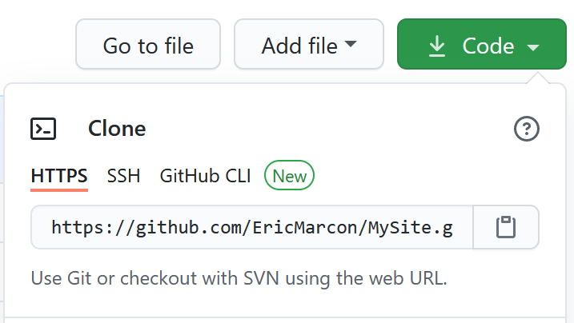
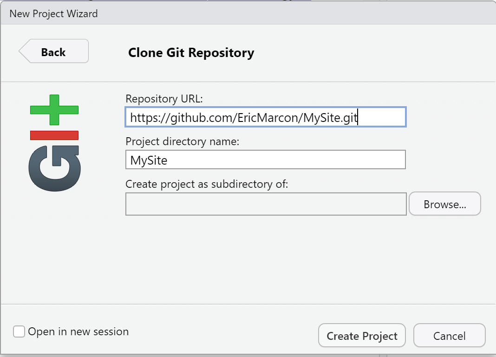
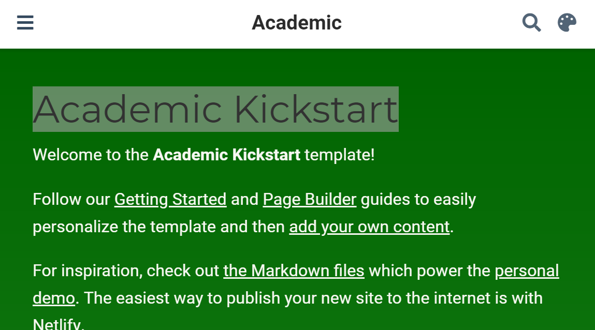
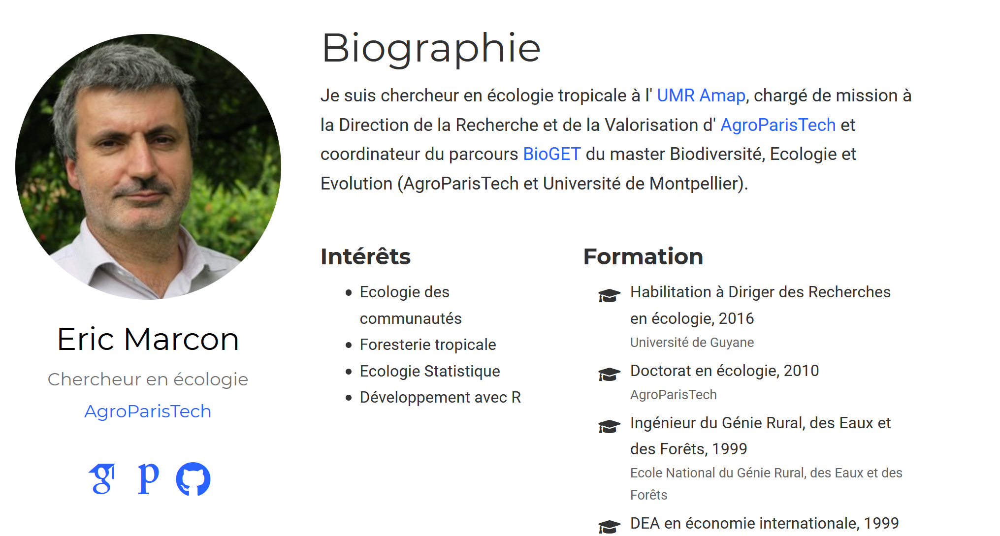
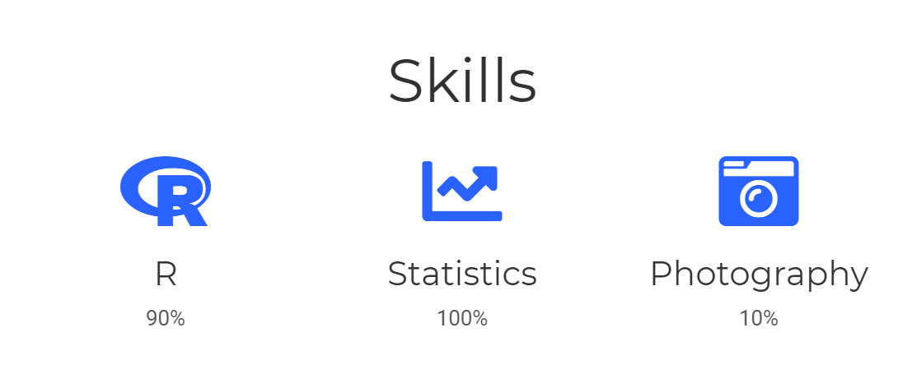
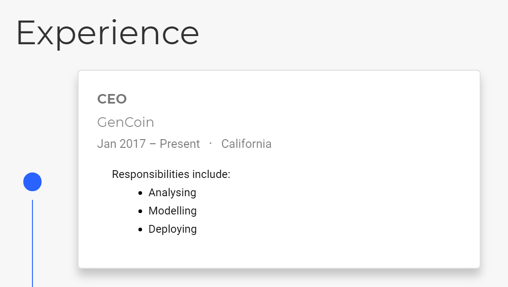

# Writing {#chap-rediger}

\toc{1}

R and RStudio make it possible to efficiently write documents of all formats, from simple notepads to theses to slide shows.
The tools to do this are the subject of this chapter, completed by the production of web sites (including a personal site).

Two document production processes are available:

- *R Markdown* with the **knitR** and **bookdown** packages. 
This is the classic method, presented here in detail.
- *Quarto*, designed to be used with languages beyond R and in working environments beyond RStudio.
Quarto is under active development but does not yet allow documents to be produced with the same quality as *R Markdown*: for example, punctuation in French documents is not handled correctly in PDF[^rediger-41], tables cannot include equations[^rediger-42] and the width of figures is inconsistent in PDF documents formatted with several columns[^rediger-43].
The use of Quarto is well documented on its site[^rediger-40] and is not presented here.

[^rediger-40]: <https://quarto.org/>
[^rediger-41]: <https://github.com/jgm/pandoc/issues/8283/>
[^rediger-42]: <https://github.com/quarto-dev/quarto-cli/issues/555>
[^rediger-43]: <https://github.com/quarto-dev/quarto-cli/issues/855>


## Markdown notebook (R Notebook)

In an `.R` file, the code should always be commented to make it easier to read.
When the explanation of the code requires several lines of comment per line or block of code, it is time to reverse the logic and place the code in the text.

The concept of literate programming was developed by @Knuth1984.
It consists in describing the objectives and methods by text, in which the code is integrated.

The simplest tool is the Markdown notebook (Menu "File > New File > R Notebook").
The document template contains its instructions for use.

The language for formatting the text is Markdown[^rediger-1], an easy to use markup language:

[^rediger-1]: <https://fr.wikipedia.org/wiki/Markdown>

- Paragraphs are separated by line breaks.
- The document is structured by headings: their line starts with a number of `#` corresponding to their level.
- Character formats are limited to the essentials: italic or bold (text surrounded by one or two `*`).
- Other simple codes allow all useful formatting.

This language is the core of the pandoc[^rediger-2] software, dedicated to converting documents of different formats.

[^rediger-2]: <https://fr.wikipedia.org/wiki/Pandoc>

The **rmarkdown** package [@Xie2015] bridges the gap between R and Markdown, relying on the RStudio interface which is not essential but greatly simplifies its use.
The Markdown dialect used by the package is called *R Markdown*.
Its syntax is summarized in a cheat sheet[^rediger-3].
Its complete documentation is online [@Xie2018].

[^rediger-3]: <https://rstudio.com/wp-content/uploads/2015/02/rmarkdown-cheatsheet.pdf>

Equations are written in the LaTeX format[^rediger-4].

[^rediger-4]: <https://fr.wikibooks.org/wiki/LaTeX/%C3%89crire_des_math%C3%A9matiques>

The simplest organization of a *R Markdown* document can be seen in the notepad template.
It starts with a header in YAML format[^rediger-5]:

[^rediger-5]: <https://fr.wikipedia.org/wiki/YAML>

```
---
title: "R Notebook"
output: html_notebook
---
```

The first entry is the title, the second is the output format: more precisely the name of the function that will process the document.

The document contains Markdown formatted text and code chunks surrounded by three backquotes (the Markdown syntax of a code block) and a language description, here `r`.
These code chunks are processed by **knitr** which transforms the result of the execution of the R code into Markdown and integrates it into the text of the document.

Processing an R Markdown document is called *knitting*.
The production chain is as follows:

- **knitr** processes the code snippets: calculations, figure production.
- **rmarkdown** integrates the production of code and text snippets to produce a standard Markdown file.
- pandoc (installed with RStudio) converts this file to HTML, LaTeX or Word format.
- LaTeX produces a PDF file when that format is requested.

RStudio allows knitting to be started by buttons rather than commands: in the source window (the top left one), a "Knit" button accompanies R Markdown documents.
For R Markdown notebooks, it is replaced by a "Preview" button with the same functions.
It can be scrolled down to choose the output format: HTML, Word, PDF (via LaTeX) and, for notepads, a "Preview" command that displays the document in HTML without executing the code snippets to save time.
As soon as the first knitting is done in Word or HTML format, you will notice that the "Preview" button disappears.

In the end, using R Markdown combines several advantages:

- Simplicity of writing: the raw text is easier to read and format than in LaTeX for example.
- Automation of the production: formatting and layout are fully automatic.
- Reproducibility: each document can be self-sufficient with its data. Re-knitting regenerates the whole document, including the necessary calculations and the production of figures.

It also has some disadvantages:

- Formatting depends on templates, and developing new templates is not easy.
- Knitting errors are sometimes difficult to correct, especially when they occur at the LaTeX compilation stage.
- Reproducibility consumes computing time. 
To limit this problem, a cache system allows not to re-evaluate all the R code bits at each modification of the text. 
The production of large documents can also be delegated to a continuous integration system (see chapter \@ref(chap-ci)).

## R Markdown templates

More elaborate document templates than the notepad are provided by packages, including **rmarkdown**.
They are accessible via the menu "File > New File > R Markdown..." (figure \@ref(fig:e-rmd1)).

(ref:e-rmd1) New Markdown document from a template.
```{r e-rmd1, fig.cap="(ref:e-rmd1)", echo=FALSE}
knitr::include_graphics('images/e-rmd1.png')
```

The simplest templates are *Document* and *Presentation*.
The information to be provided is the title and the name of the author, and the format of the expected document (which can be modified later).
These templates create a single file which will only need to be saved when knitting.

The syntax is the same as for the notepad.
In the header, an extra entry is used for the date, which can be calculated by R at each knitting:

```
date: "|r format(Sys.Date(), '%d/%m/%Y')|"
```

Replace the vertical bars `|` in the above example with backquotes: since this document is written with R Markdown, the date would be calculated and displayed instead of the code if the backquotes were used directly.

Inline R code (as opposed to code snippets) can be used anywhere in an R Markdown document, including in the header for the date display.
It starts with a backquote followed by `r' and ends with another backquote.

Documents can be knitted in HTML, PDF (via LaTeX) or Word format.
The header of the R Markdown file is rewritten when the knitting is started by the RStudio button which places the current output format on top of the list.

Presentations can be knitted in two HTML formats, ioslide[^rediger-6] or Slidy[^rediger-7], in Beamer (PDF) format[^rediger-8] or in Powerpoint[^rediger-9].

[^rediger-6]: <https://bookdown.org/yihui/rmarkdown/ioslides-presentation.html>

[^rediger-7]: <https://bookdown.org/yihui/rmarkdown/slidy-presentation.html>

[^rediger-8]: <https://bookdown.org/yihui/rmarkdown/beamer-presentation.html>

[^rediger-9]: <https://bookdown.org/yihui/rmarkdown/powerpoint-presentation.html>

The level 2 outline (`##`) marks the change of slide.

Additional code, presented in the HTML format documentations, allows for specific functionality.

These templates are simple but not very useful: the R notepad is easier to use than the document template for minimalist documents.
More elaborate templates are available.

## Articles with bookdown

R Markdown does not allow you to write a scientific article.
Bibliography is not a problem because it is handled by pandoc for HTML or Word documents and outsourced to LaTeX for PDF documents.
Equations, figures and tables are numbered by LaTeX but not in HTML.
Cross-references (references to a figure number for example) are not supported.
Finally, figure and table captions only support plain text, without any formatting.

**bookdown** fills these gaps.
The package has been designed for writing books with several chapters but can be used for articles.

The **memoiR** package provides the templates shown here.
It must be installed.

### Writing

The main features of Markdown are summarized here.
A quick and more complete training is offered by RStudio[^402].

[^402]: https://rmarkdown.rstudio.com/lesson-1.html

The text is written without any formatting other than line breaks.
A simple line break has no effect on the document produced: it allows to separate sentences to simplify the tracking of the source code by git.

A line break marks a paragraph change.

The different levels of the plan are designated by the number of hashes at the beginning of the line: `#` for a level-1 title, `##` for a level-2 title, etc.
A space separates the hashes and the title text.

Bullet lists are marked by a dash (followed by a space) at the beginning of the line.
A double line break is required before the beginning of the list, but the elements of the list are separated by a simple line break.
Indented lists are created by inserting 4 spaces before the dash at the beginning of the line.
Last, numbered lists are created in the same way by replacing the hyphens by numbers, whose value is not important.

In the text, the italicized parts are surrounded by a star or an underscore (`*italic*`), while two stars mark the bold.

#### R code

R code is included in code chunks that are easily created by clicking on the "Insert a new code chunk" button above the source code window in RStudio.
They start and end with three backquotes on a new line.
These code chunks can contain R code but also Python code for example: the type of code is indicated in the header on the first line, before the name of the code chunk, then a comma-separated list of options, for example: 

````
```{r cars, echo=TRUE}`r ''`
```
````

The name and options are optional: the minimum header is `{r}`.

The most useful options are :

- `echo` to show (`=TRUE`) or hide (`=FALSE`) the code.
- `message=FALSE` to hide the opening messages of some packages.
- `warning=FALSE` to hide warnings.

The default options are declared in the code snippet named "Options" at the beginning of the Markdown document, in the `opts_chunk$set()` function.

The `include=FALSE` option removes any display related to the code snippet.
In a document such as a scientific article, which does not display its code, it should be used for all code snippets except those that produce figures.


#### Figures

```{r pressure, fig.cap="Figure Title"}
plot(pressure)
```

Figures can be created by the R code (figure \@ref(fig:pressure)).
With Bookdown, a label is associated with each figure: its name is `fig:xxx` where `xxx` is the name of the R code snippet.
References are made with the command `\@ref(fig:xxx)`.

The header of the code snippet of the figure \@ref(fig:pressure) is:

````
```{r pressure, fig.cap="Caption of the figure"}`r ''`
```
````

It contains at least the name of the figure and its caption. 
If the caption is long, the header is not very readable.
Furthermore, the caption is limited to simple text.
For more elaborate captions, it is possible to declare the caption in a separate paragraph that begins with the text `(ref:FigureName)`. 
Figure \@ref(fig:pressure2) benefits from an improved caption.

(ref:pressure2) Title with _italic_, math ($\sqrt\pi$) and a reference to figure \@ref(fig:pressure)
```{r pressure2, fig.cap="(ref:pressure2)", echo=FALSE}
plot(pressure)
```

The text in `fig.cap`, "Title of figure" previously, is replaced by `(ref:pressure)` _within the backquotes_ which are retained and the caption is entered in a paragraph starting with `(ref:pressure)` followed by a space.
Captions are limited to a single paragraph.

If a table of figures is used (option `lof: true` in the header), a short caption is required in addition to the full caption.
It is declared in `fig.scap`.

Figures that are not created by R but come from files are integrated in a piece of code by the `include_graphics()` function whose argument is the file containing the image to be displayed.
Always place these files in the `images` folder for good organization.

#### Tables

The horizontal `-` and vertical `|` separators allow to draw a table according to the Markdown syntax, but it is not the best method.

Tables can also be produced by R code.
The content of the table is in a dataframe.
The `kbl` function in the _kableExtra_ package prepares the table for display and passes the result to the `kable_styling` function for final formatting.

```{r kable, echo=TRUE, warning=FALSE}
library("tidyverse")
my_iris <- head(iris)
names(my_iris) <- c("Sepal length ($l_s$)", "Width", "Petal length", "Width", "Species")
kableExtra::kbl(my_iris, caption="Table created by kable", booktabs = TRUE, escape = FALSE) %>%
  kableExtra::kable_styling(bootstrap_options = "striped", full_width = FALSE)
```

The caption is specified by the `caption` argument and referencing is possible because the table is given a label whose name is `tab:` followed by the name of the code snippet (table \@ref(tab:kable)).
As with the figures, an enhanced caption can be written in a separate paragraph.
A short caption for a possible list of tables (option `lot: true` in the header) is declared in the `caption.short` argument of `kbl()`.

Always use the `booktabs = TRUE` argument so that the thickness of the separator lines is optimal in LaTeX.
Since the table contains mathematics (in the name of the first column), the `escape = FALSE` option is necessary.

The `bootstrap_options = "striped"` style option provides more readable tables in HTML.
Last, the `full_width = FALSE` option allows to adjust the width of the table to its content instead of occupying the whole available width.

The **flextable** package allows creating more elaborate tables, as in the following example which displays the long sepals in color.

```{r flextable}
library("flextable")
# iris dataset
iris %>%
  # First lines
  head() %>% 
  # Create a flextable object
  flextable() %>%
  # Column titles
  set_header_labels(Sepal.Length="Sepal Length",
                    Sepal.Width="Width", 
                    Petal.Length="Petal Length",
                    Petal.Width="Width",
                    Species="Species") %>%
  # Select long sepals (>5) and display them in red
  color(~Sepal.Length > 5, ~Sepal.Length, color="red")
```

The package documentation[^411] is available online, as well as a gallery[^412].

[^411]: https://ardata-fr.github.io/flextable-book/

[^412]: https://ardata-fr.github.io/flextable-gallery/gallery/

**flextable** does not support caption numbering except in Word documents.
This limitation is prohibitive.


#### Maths

Equations in LaTeX format can be inserted inline, like $A=\pi r^2$ (code: `$A=\pi r^2$`) or in a new line (the $ are doubled) like $$e^{i \pi} = -1.$$

They can be numbered: see equation \@ref(eq:disc), using the `\equation` environment.

\begin{equation}
  A = \pi r^2.
  (\#eq:disc)
\end{equation}

The numbered equation is created by the following code:

```
\begin{equation}
  A = \pi r^2.
  (\#eq:disc)
\end{equation}
```

#### Cross-references

Figures and tables have an automatically generated label, identical to the name of the code snippet prefixed with `fig:` and `tab:`.

For equations, the label is added manually by the code `(\#eq:xxx)` before the end of the equation.

Sections can be given a label by completing their title with `{#yyy}`.
Sections receive by default an implicit label[^405] corresponding to their text, in lower case, where special characters are replaced by dashes.
Implicit labels are unstable (they change with the title of the section) and difficult to predict: this is why it is advisable to add an explicit label to each section being cross-referenced.
This is the case for chapters, for which the name of the HMTL file produced is identical to the label.
Chapter labels must follow file naming rules by not containing special characters.

[^405]: https://pandoc.org/MANUAL.html#extension-implicit_header_references

Bookmarks can also be placed freely in the text with the command `(ref:zzz)`.

In all cases, the call to the reference is made by the command `\@ref(ref:zzz)`.


#### Bibliography

Bibliographic references in BibTeX format must be included in the `.bib` file declared in the header of the Markdown document.

```
bibliography: references.bib
```

This file can be created and maintained by Zotero installed with the Better BibTeX extension (see section \@ref(sec:Zotero)).
To do this, you just have to create a Zotero collection corresponding to the project and drag the relevant references into it.
Then use the contextual menu "Export collection..." and select:

- Format: "Better BibTeX" for articles and presentations or "Better BibLaTeX" for memoirs, depending on whether the bibliography is managed by BibTeX and natbib or biber and BibLaTeX for PDF production.
- Check the "Keep up to date" box so that any changes in Zotero are exported automatically.
- Click on "OK" then choose the name of the file (`references.bib`) and its location (the R project folder).

The references can be called in the text, between square brackets by the code `[@Reference]`, or in the text, by removing the brackets.

The bibliography is handled by pandoc when producing Word or HTML documents.
The bibliographic style can be specified, by adding the line 

```
csl:nom_du_fichier.csl
```

in the document header and copying the _.csl_ style file to the project folder.
Over a thousand styles are available[^401].

[^401]: <https://github.com/citation-style-language/styles>

For PDF documents, the bibliography is managed by LaTeX.

To prepare the submission of a manuscript to a journal, it will be necessary to open the intermediate _.tex_ file produced by pandoc and copy the contents of the environment \{document\} into the template proposed by the journal, which will take care of the formatting.

#### Languages

The languages are to be declared in the header of the documents produced by the **memoiR** templates.

The main language of the document modifies the name of certain elements, such as the table of contents.
The additional languages allow the creation of multilingual documents.

The header fields are:

```
lang: fr-FR
otherlangs: [en-US, it]
```

The change of language in the document is managed in LaTeX, but not in HTML, by inserting on a new line the following command:

```
\selectlanguage{english}
```

The current language only has an effect in LaTeX output: a space is added before double punctuation in French, the size of spaces is larger at the beginning of sentences in English, etc.
The `\selectlanguage` command is simply ignored in HTML.

The language names are different in the header (IETF codes) and in the text (language name).
The correspondence and the complete list of languages can be found in table 3 of the package documentation **polyglossia**[^403].

[^403]: http://mirrors.ctan.org/macros/unicodetex/latex/polyglossia/polyglossia.pdf

HTML formatting of punctuation in French documents is possible using a filter declared in pandoc [^450].
The `fr-nbsp.lua` file must be copied into the project directory from its GitHub repository and declared into the header of the Markdown document.

```
output:
    pandoc_args:
      --lua-filter=en-nbsp.lua
```

The filter formats all the punctuation in the document, whatever the language: it should therefore only be used for documents written entirely in French.

[^450]: https://github.com/InseeFrLab/pandoc-filter-fr-nbsp

### Simple Article template {#sec:memo}

The *Simple Article* template of **memoiR** produces a simple HTML document with a floating table of contents (see example[^rediger-10]).
Other HTML formats are available: see the gallery[^404] of the package.
The PDF format is close to the *article* model of LaTeX (example[^rediger-11]).

[^404]: https://ericmarcon.github.io/memoiR/

[^rediger-10]: <https://EricMarcon.github.io/Krigeage/Krigeage.html>

[^rediger-11]: <https://EricMarcon.github.io/Krigeage/Krigeage.pdf>

The template contains its own documentation.

#### Create

Use the menu "File > New File > R Markdown..." then select "From template" (figure \@ref(fig:e-rmd1)).
The list of available templates and the package that offers them is then displayed.

Select the *Simple Article* template from the **memoiR** package, choose the name of the project ("Name:", which will be the name of the folder in which it will be created, and its parent folder ("Location:").
In the organization proposed in section \@ref(sec:solution-dossiers), the parent folder is `%LOCALAPPDATA%\ProjectsR`.
The project name must not contain any special characters (accent, space...) to ensure its portability on all operating systems (Windows, Linux, MacOS).

Advanced templates create a folder with many files (bibliography, styles, LaTeX template...), unlike simple templates which create only one file.

When a folder is created, for example by the *Simple Article* template, you have to make it an RStudio project: in the projects menu (top right of the RStudio window), use the "New Project..." menu, then "Existing Directory" and select the folder that has just been created.

#### Write

The instructions for using the template are contained in the text provided by default.

#### Knit

The document can be knitted in several formats:

- *html_document2* is the HTML format the template was designed for: a notepad with a floating table of contents.
- *gitbook* is an alternative HTML format, normally used for books.
- *downcute* is an HTML format provided by the **rmdformats** package.
- *pdf_book* produces a PDF document following the LaTeX *article* template, commonly used directly in LaTeX.
- *word_document2* creates a Word file.


#### Publish {#sec:article-en-ligne}

The **memoiR** package simplifies the uploading of produced documents to a web server.

The `build_gitignore()` function creates a `.gitignore` file for source control which must be enabled (see section \@ref(sec:git-cds)).

The `build_readme()` function creates a `README.md` file that is needed by GitHub.
It contains the title of the project, its summary and links to the HTML and PDF versions of the documents produced.

The project must be linked to a GitHub repository (section \@ref(sec:creerdepot)).

Two publication strategies are possible. 
In the first one, the documents are knitted locally and placed in the `docs` folder, which will be the support of the GitHub pages.
In the second one, the documents are knitted by GitHub Actions each time modifications are pushed on the repository: this is called continuous integration (section \@ref(chap-ci)).

The local production strategy is covered here; continuous integration will be covered in section \@ref(sec:memoiR-ci).

The `build_githubpages()` function places all the knitted documents (HTML and PDF) in the `docs` folder, along with a copy of the `README.md` file.
This way, it is possible to activate the project's GitHub pages (on the `docs` folder of the `master` branch).
The `README.md` file will be the home page of the produced web site.

In practice, we knit in HTML format during the whole writing phase, because the production is very fast.
When the document is stabilized, it should be knitted in HTML and PDF format.
Finally, the execution of `build_githubpages()` places all the files produced in `docs`.
It remains to push the repository on GitHub and activate the GitHub pages.


### Other templates

The *Stylish Article* template of **memoiR** is intended for the production of well-formatted PDF articles for self-archiving (typically, the HAL repository), in A4 format in double column[^rediger-12].

[^rediger-12]: Exemple: <https://EricMarcon.github.io/Rochebrune2018/Entropie.pdf>

The HTML format is the same as the *Simple Article* template.

The **rticles** package aims to provide templates for all scientific journals that accept article submission in LaTeX.
It offers Markdown templates which produce PDF files conforming to the requirements of the journals and the possibility to recover the intermediate `.tex` file (pandoc produces a `.tex` file transmitted to the LaTeX compiler).
The package does not allow HTML knitting because it uses LaTeX syntax in the R Markdown document instead of using **bookdown** to handle bibliographic and cross references.
It is not possible to directly exchange standard R Markdown content with documents written for **rticles**, which limits the interest of the package.


## Beamer Presentation

The *Beamer Presentation* template of **memoiR** allows to create HTML and PDF (beamer) presentations simultaneously, as shown in the example[^rediger-13].

[^rediger-13]: <https://EricMarcon.github.io/Chao1/>, Choose "Lecture" (Read in HTML) ou "Téléchargement" (Download PDF).

The approach is identical to that of articles in the same package.
The title levels allow separating the parts of the presentation (`#`) and the slides (`##`).
Two formats are available in HTML: ioslides[^rediger-14] and Slidy[^rediger-15]. 
Some specificities in the code allow to refine the presentation of the slides, for a two-column display for example: they are documented in the template.

[^rediger-14]: <https://bookdown.org/yihui/rmarkdown/ioslides-presentation.html>

[^rediger-15]: <https://bookdown.org/yihui/rmarkdown/slidy-presentation.html>


## memoir

The *Memoir* template of the **memoiR** package is intended for long documents, which have an important difference from the previous documents: a long document is composed of several chapters, each placed in its `.Rmd` file.

The HTML format is gitbook[^rediger-16], the standard for reading such documents online.
The PDF format is derived from the LaTeX *memoir*[^rediger-17] template, also optimized for long documents.

[^rediger-16]: <https://www.gitbook.com/>

[^rediger-17]: <https://www.ctan.org/pkg/memoir>

This document was written with this template.

### Create

Creating a work project is identical to the one presented above: the template is: *Memoir*. 
The created folder must be turned into a project.

Run `build_git()` and `build_readme()`, enable source control and push the project to GitHub, in the same way as for an article (section \@ref(sec:article-en-ligne)).

Each chapter of the book is an Rmd file, whose name normally starts with its number (e.g.: `01-intro.Rmd`).
All Rmd files in the project folder are actually treated as chapters, sorted by filename, including those provided by the template (startup and syntax) which should be deleted except for `99-references.Rmd` which contains the bibliography, placed at the end.
The `index.Rmd` file is special: it contains the document header and the first chapter.

### Write

The first chapter is placed in the front matter of the printed book: it should not be numbered (hence the `{-}` code next to the title) in the HTML version.
It must end with the LaTeX command `\mainmatter` which marks the beginning of the body of the book.

The outline levels start with `#` for chapters (only one per file), `##` for sections, etc.

### Knit

Compiling to PDF is done by XeLaTeX, which must be installed.

While writing, it is strongly advised to create only the HTML file, which is much faster than a LaTeX compilation.
Each chapter can be viewed very quickly by clicking on the "Knit" button above the source window.
The entire book is created by clicking on the "Build Book" button in the RStudio *Build* window.
The button's drop-down list allows you to create all documents or limit yourself to one format.

The files produced are placed directly in the `docs` folder, which will be used by the GitHub pages to allow online reading and downloading of the PDF.
The home page of the website is created by bookdown from the `index.Rmd` file: the `README.md` file is not duplicated in `docs`.


### Finishing

The layout is done fully automatically by pandoc (in HTML) and LaTeX (in PDF).

It is often useful to help LaTeX to solve some margin overruns due to too large layout constraints: for optimal readability, columns are narrow, but code (formatted text between backquotes) does not allow hyphenation.

If a line of text protrudes into the right margin in the PDF document, the solution is to manually add the `\break` code to the desired location for the line break in the R Markdown document.
The command has no effect on the HTML document but forces the hyphenation in LaTeX.
To break formatted text (between asterisks for italics or more frequently between backquotes for code), you must finish formatting before `\break` and start again afterwards.
For example, to force a line break before `file.Rmd`:

```
The file `/path/`\break`file.Rmd`
```

In HTML, a space will be added between the two pieces of code.

R code snippets are automatically formatted by **knitr** when the `tidy=TRUE` option is applied to them.
The default behavior is specified in the **knitr** options, in a code snippet at the beginning of the `index.Rmd` file:

```{r opts_chunk, eval=FALSE, tidy=FALSE}
# knitr options
knitr::opts_chunk$set(
  cache=TRUE, warning=FALSE, echo = TRUE,
  fig.env='SCfigure', fig.asp=.75, 
  fig.align='center', out.width='80%', 
  tidy=TRUE, 
  tidy.opts=list(blank=FALSE, width.cutoff=55), 
    size="scriptsize",
  knitr.graphics.auto_pdf = TRUE)
```

The maximum width of a line of formatted code here is 55 characters, optimal for the template.
Sometimes automatic formatting does not work because **knitr** cannot find a line break that meets all the constraints, causing the code to overflow.
In this case, manually format the code snippet by adding the `tidy=FALSE` option.

The literal code blocks, delimited by three backquotes, must be formatted manually, avoiding any line longer than 55 characters.


### Gitbook site

The website containing the gitbook document must be set up in `_output.yml` so that :

- The title of the document appears at the top of the table of contents.
- An indication of the use of GitHub and bookdown is displayed at the bottom of the table of contents.
- A GitHub button in the title bar allows to open the project repository.
- Another button allows to download the PDF document.

The `_output.yml` file of this document is the following:

```
bookdown::gitbook:
  css: style.css
  config:
    sharing:
      github: yes
      facebook: false
      twitter: false
    toc:
      before: |
        <li><a href="./">Working with R</a></li>
      after: |
        <li>
          <a href="https://github.com/EricMarcon/WorkingWithR" target="blank">
            Hosted on GitHub, published by bookdown
          </a>
        </li>
    download: pdf
```

The `sharing:` section manages the buttons in the title bar.
By default, the links to Facebook and Twitter are enabled but the one to GitHub is not.
For it to work, the GitHub repository must be declared in the header of the `index.rmd` file:

```
github-repo: EricMarcon/WorkingWithR
```

The `toc:` section contains two portions of HTML code in which the title of the document and the link to its GitHub repository must be adapted to the project.

Finally, the `download:` section lists the downloadable document formats and displays a download button in the title bar.


### Continuous integration {#sec:rediger-ouvrage-ci}

Building a book takes time, especially if it contains calculations.
It must be launched in gitbook format and in PDF format.
In production, it can be outsourced to GitHub (chapter \@ref(sec:bookdown-ci)).

### Google Analytics

The tracking of the book's audience can be entrusted to Google Analytics.
To do so, you have to create an account and add a Google Analytics *property*, i.e. a website, then a data feed, here a web feed[^rediger-37].

[^rediger-37]: https://support.google.com/analytics/answer/9304153?hl=fr&ref_topic=9303319

Google Analytics provides a configuration script named `gtag.js` to be placed at the root of the project folder.
Finally, declare the script in the header of the web pages by adding a statement in `_output.yml`, in its first section.


```
bookdown::gitbook:
  includes:
    in_header: gtag.js
```


## R Markdown web site

A web site made of pages written with R Markdown (without the **bookdown** features) and a menu can be created very easily, with a good result[^rediger-18].


[^rediger-18]: <https://rstudio.github.io/learnr/> for example.

### Template

In RStudio, in the projects menu at the top right, click on "New Project..." then "New Directory" then "Simple R Markdown website".
Enter the name of the project, select the folder in which the project will be created by clicking on "Browse" and finally click on "Create Project".

The default site contains two pages: `index`, the home page, and `about`, the "About" page.
The `_site.yml` file contains the name of the site and the contents of its navigation bar: a title and the corresponding file.
Other pages will be added by creating new `.Rmd` files and adding them to the `_site.yml` file.

### Improvements

The site template can easily be enhanced by adding lines to `_site.yml`:

- To add a GitHub icon in the navigation bar to link to the site source code.
- To choose the method of knitting, to use **bookdown** instead of **rmarkdown**.
- To place the site files in the `docs` folder and thus separate code and production.

The completed `_site.yml` file is as follows:

```
name: "my-website"
navbar:
  title: "My Website"
  left:
    - text: "Home"
      href: index.html
    - text: "About"
      href: about.html
  right:
    - icon: fa-github
      href: https://github.com/rstudio/rmarkdown
output_dir: "docs"
output:
  bookdown::html_document2:
    theme: sandstone
    highlight: tango
    toc: true
    toc_float: yes
```

The GitHub icon is part of the Font Awesome collection of which all free icons[^rediger-19] are usable with the same syntax: "fa-name".

[^rediger-19]: <https://fontawesome.com/icons?d=gallery&m=free>

The link corresponding to the icon must be the one in the website's GitHub repository.

The syntax of the `output` section is the same as that of the documents seen above.
It applies to all pages (with the YAML header reduced to the minimum).
The available themes are those of rmarkdown[^rediger-20].

[^rediger-20]: <https://bookdown.org/yihui/rmarkdown/html-document.html#appearance-and-style>

The `highlight` option specifies how any R code displayed will be formatted.
Last, the table of contents is floating, which means that its position adjusts as the window scrolls.

### Source control

The project must be put under source control and pushed to GitHub (chapter \@ref(chap-git)).
The `.gitignore` file is the following:

```
# R
.Rbuildignore
.RData
.Rhistory
.Rprofile
.Rproj.user

# Web Site
/_site/
/*_cache/
/*_files/
```

Enable GitHub pages (section \@ref(sec:github-pages)) on the `docs` folder to host the site.
Add an empty file named `.nojekyll` in `docs` so that GitHub pages won't try to reformat the site.
You can use the RStudio terminal to run:

```
touch docs/.nojekyll
```


## Personal web site: blogdown {#sec:blogdown}

To create a personal web page, *Hugo* is a static site generator capable of producing HTML pages from Markdown code.
Static sites have the advantage, compared to dynamic sites managed by a content management system (CMS, for example: Wordpress, Joomla, SPIP), to be portable on any web server without database support or code to run on the server side (such as PHP) and to be very fast since the pages are created once and not at each consultation.
A Hugo site can be hosted for example on the personal page of any GitHub user.
Its address is of the form "GitHubID.github.io".

Hugo offers many themes, which are templates for site structure, so the **Academic** theme, intended for researchers.
In RStudio, the **blogdown** package is provided to easily produce web pages with Hugo.
These pages can contain R code: they are very similar to an article, seen above, whose content can be easily copied and pasted.
So we will use this solution, for a site like the one proposed in example[^rediger-21].

[^rediger-21]: <https://EricMarcon.github.io/>

The structure of the website is simple:

- A home page, containing various customizable components such as the author's biography, a selection of publications, blog posts or other elements and a contact form.
- Pages detailing the various elements (publications, posts, etc.) written in R Markdown.


### Installing the tools

The first step is to install the **blogdown** package in R.

```{r blogdown, eval=FALSE}
install.packages('blogdown') 
```

**blogdown** is able to install Hugo on Windows, macOS or Linux.

```{r Hugo, eval=FALSE}
blogdown::install_hugo()
```

The full documentation for **blogdown** is available[^rediger-22].

[^rediger-22]: <https://bookdown.org/yihui/blogdown/>

Recent versions of Hugo use *Go* (the programming language) to install their modules on the fly: here the Academic theme is loaded from GitHub at the time of site creation.
Go must therefore be installed[^rediger-23].

[^rediger-23]: <https://golang.org/doc/install>

### Create

The easiest way is to create a repository on GitHub from the template.
On the *starter-academic*[^rediger-24] repository page, click on the "Use this template" button, optionally authenticate to GitHub, and then enter the name of the repository that will contain the project, for example "MySite".

[^rediger-24]: <https://github.com/wowchemy/starter-academic>

The repository can be the one of the main site of your GitHub account (see section \@ref(sec:github-pages)), at the address https://GitHubID.github.io[^rediger-45].
The name to enter is simply "GitHubID.github.io" (*GitHubID* is the name of the GitHub account).

[^rediger-45]: Exemple: https://EricMarcon.github.io/Krigeage/

Create the repository.
Copy the repository address by clicking on the "Code" button and then on the button to the right of the address (figure \@ref(fig:rediger-GitHub-Clone)).

(ref:rediger-GitHub-Clone) Copy of the address of a repository to clone on GitHub.

```{r rediger-GitHub-Clone, fig.cap="(ref:rediger-GitHub-Clone)", echo=FALSE}

```

In RStudio, create a new project from GitHub: in the projects menu on the top right, click on "New Project..." then "Version Control" then "Git" then paste the address in the "Repository URL" field (figure \@ref(fig:rediger-Projet-GitHub)).
Select the folder in which the project will be created by clicking on "Browse" and finally click on "Create Project".

(ref:rediger-Projet-GitHub) Copy the address of a repository to clone to GitHub.
```{r rediger-Projet-GitHub, fig.cap="(ref:rediger-Projet-GitHub)", echo=FALSE}

```

The created project is an exact copy of the template, which must be customized.

RStudio automatically adds a line at the end of the `.gitignore` file to ignore its working files (`.Rproj.user` folder).
Add a comment line to indicate this.
The content of `.gitignore` should be as follows:

```
# R
.Rbuildignore
.RData
.Rhistory
.Rprofile
.Rproj.user

# Hugo
/resources/
/public/

# blogdown
/static/en/
/static/fr/
*.rmarkdown
_index.html
index.html
**/index_files/
```

A bug of **blogdown** requires to move the file `config.toml` from the folder `config/_default/` to the root of the project.

Take into account these modifications in git by making a commit.

### Building the site

Run

```{r build_site, eval=FALSE}
blogdown::build_site(build_rmd = TRUE)
```

to build the website, including its future R Markdown pages.

To display the site, run :

```{r serve_site, eval=FALSE}
blogdown:::serve_site()
```

It appears in the RStudio *Viewer* window, which can be viewed in the system's default web browser by clicking the enlarge button.

To modify the content of the site, it is best to stop the web server with the command:

```{r stop_server, eval=FALSE}
blogdown:::stop_server()
```

The site produced by **blogdown** is located in the `public` folder which can be copied directly to a web server that will host it.
A simple solution is to declare this folder as the root of the GitHub pages of the project 
(section \@ref(sec:github-pages)).
The optimal method is to use continuous integration (see section \@ref(sec:blogdown-ci)) to copy it to the root of the `gh-pages` branch which will be declared as the location of the site on GitHub.


### Multilingual site

If the site is multilingual (say English and French), its `content` folder must be copied in a folder corresponding to each language.
The files in `content/authors/admin/` must be duplicated into `content/en/authors`\break`/admin/` and `content/fr/authors/admin/`.
In practice, create an `en` folder and an `fr` folder in `content`.
Move all the original `content` folder `en` and then copy it into `fr`.


### Set up

The site configuration files are well documented and offer many options.
The main ones are reviewed here for a quick creation of a working site.

The `config.toml` file contains the general parameters of the site.
The lines to be updated are the site title (the owner's name since it is a personal site) and its public address.
For the example site:

```
title = "Eric Marcon"
baseurl = "https://EricMarcon.github.io/"
```

It also contains the default language selection line ("en" or "fr") and the line that allows to place the files produced by Hugo in each language folder ("true" mandatory for a multilingual site):

```
defaultContentLanguage = "en"
defaultContentLanguageInSubdir = true
```

The `config/_default/` folder contains the other configuration files.

The `languages.toml` folder contains the language settings and menu translations.
For each language, the version used and the content folder are specified:

```
[en]
  languageCode = "en-us"
  contentDir = "content/en"
[fr]
  languageCode = "fr-fr"
  contentDir = "content/fr"
```

For additional languages, the site title, date display settings and menu translation are added.
In the section `[fr]`:

```
[fr]
  languageCode = "fr-fr"
  contentDir = "content/fr"
  title = "Eric Marcon"
  description = "Page personnelle d'Eric Marcon"
  [fr.params]
    description = ""
    date_format = "02-Jan-2006"
    time_format = "15:04"
  [[fr.menu.main]]
    name = "Accueil"
    url = "#about"
    weight = 20
(...)
```

These lines are commented out in the template and must therefore be uncommented by removing the `#` at the head of the line.

The menus are described below.

`params.toml` describes the look of the site.
The options are grouped by topic, for example "Theme" for the general appearance.
In "Basic Info", the line

```
site_type = "Person"
```

selects a personal site.
It is possible to use Academic for a scientific project site or a unit site, not documented in detail here.
The main differences are, for a collective site:

- The management of authors: in the `/contents/<language>/outside` folder, only one `admin` folder is used for a personal site, whereas one folder per person is needed for a collective site.
- A component described below, which allows to present the persons, must be activated.

The description of the site in the default language is entered, for search engines:

```
description = "Eric Marcon's Homepage"
```

It must be translated in the file `languages.toml`, in each language.

In "Site Features", we select the coloring of the R code, the activation of the formatting of equations and the legal warning for the use of cookies.

```
highlight_languages = ["r"] 
math = true
privacy_pack = true
```

The `edit_page` line needs to be updated: replace the default repository "<https://github.com/gcushen/hugo-academic>" with that of the site.

"Contact details" contains the contact information for the site owner.
They must be entered.

"Regional Settings" contains the date display settings for the default language (those for other languages are in `languages.toml`).
They usually do not need to be changed.

"Comments" allows you to enable visitor comments at the bottom of pages, with Disqus or Comment.io (an account is required with the provider).
"Marketing" allows you to activate the tracking of site traffic by simply entering your Google Analytics ID (to be created with a Google account).
"Content Management System" contains the line `netlify_cms` whose value must be `false` if the site is not hosted by Netlify.
Finally "Icon Pack Extensions" allows you to activate Academicons icons if necessary.

### Write

Use the online documentation[^rediger-25] to complement the main information detailed here.
The example used here is the author's personal site[^rediger-26].

[^rediger-25]: <https://wowchemy.com/docs/page-builder/>

[^rediger-26]: <https://EricMarcon.github.io/>

The working method is to progress step by step by testing and then to validate each step:

- Make the changes.
- Build the site and check the result: `blogdown:::serve_site()`.
- Stop the site: `blogdown::stop_server()`.
- If the result is not satisfactory, try again.
- Commit the changes.

#### Home page

The home page of the site is made up of a series of elements (*widgets*) that are located in `/contents/<language>/home`.
Each element is described by a markdown file.
The first one is `index.md`.
It is usually not modified.
Its contents are as follows:

```
+++
# Homepage
type = "widget_page"
headless = true  # Homepage is headless, other widget pages are not.
+++
```

The file contains only a TOML header, surrounded by a line of `+++`.
The component type indicates that this is a component page, in which the other components in the file will fit.
`headless = true` means that the page has no header.

(ref:rediger-demo) Component `demo` in Academic.
```{r rediger-demo, fig.cap="(ref:rediger-demo)", echo=FALSE}

```

The `demo.md` component (figure \@ref(fig:rediger-demo)) is a "blank" component, i.e. a free text page: it is used here to present the Academic Kickstart template and must therefore be disabled.
The header contains its formatting information (title, number of columns, colors...) and the content of the page is written in markdown.
The components appear in ascending order of weight in the header: 15 marks the first component in the Academic template.
The component can be disabled by deleting its file or by changing its `active` property in the header:

```
active = false  # Activate this widget? true/false
```

(ref:rediger-about) The `about` component in Academic.
```{r rediger-about, fig.cap="(ref:rediger-about)", echo=FALSE}

```

The next component is `about.md` (figure \@ref(fig:rediger-about)).
It presents the owner of the site.
Its title must be localized.
In the `/content/en/home' folder, its value will be:

```
title = "Biography"
```

The author must correspond to a folder in `/contents/<language>`\break`/authors`.
The `admin` is fine for a personal site.
Academic allows for team sites: in this configuration, one folder per person would be needed.
The image displayed by the component is the `avatar.jpg` file placed in this folder.
Limit the size of the file for the performance of the site (less than a megabyte is a reasonable size), while ensuring a minimum size of a few hundred pixels per side for display quality.

The content of the component is read from the `_index.md` file in the same folder, which contains all information about the author.
Its organization is quite clear: modify its content from the example provided.
If `ai` type icons are used, enable the Academicons icon package in `config/_default/params.toml`.

(ref:rediger-skills) The `skills` component in Academic.
```{r rediger-skills, fig.cap="(ref:rediger-skills)", echo=FALSE}

```

The skills component (figure \@ref(fig:rediger-skills)) presents the author's skills graphically.
A collection of icons is available, and new icons can be added.

(ref:rediger-experience) The `experience` component in Academic.
```{r rediger-experience, fig.cap="(ref:rediger-experience)", echo=FALSE}

```

The `accomplishments` component presents the professional trainings and allows to access their certificates.

The `posts` component fetches its content from the folder which contains the blog posts, i.e. `/contents/<language>/post` (see below).
The `posts.md` file contains layout options in its header.

The `projects` component works the same way.
The difference between the two components is their formatting: `posts` is of the "pages" type, which displays the most recent items, while `projects` is of the "portfolio" type, which displays selected items that contain the description `featured: true` in their own header.
It is possible to create components of these types freely, by specifying the folder containing the items in `page-type`.
Example: create a component named `software.md` by renaming `projects.md`, change its `page_type = "software"` line and create a `/contents/<language>/software` folder to place content in.

The `publications` and `featured` components are of type `pages` and `portfolio` respectively and take their content from the `publication` folder.

The `tags` component presents a word cloud from the keywords declared in all content files (blog posts, publications...) in the following form in their header:

```
tags = ["Keyword 1", "Other Keyword"]
```

Last, the `contact` component allows to display a contact form.
It uses the information from the `config/_default/params.toml` file in its part starting with:

```
############################
## Contact details
##
```

To display a map, enter the latitude and longitude of the address in the `coordinates` line.
To display a mail form, choose the *formspree.io* service (`email_form = 2` in `contact.md`).
To activate the mail service, you will have to build the web site, send yourself a first message using the form and follow the instructions of Formspree.

The `people` component is used in group sites to present the members.
The `slider` component is used to display a carousel (scrolling elements) at the top of the page.
To understand how it works, the easiest way is to activate it.

#### Home page menu

The home page has a menu that allows you to navigate quickly to its components or to other pages.
It is set up in `config/_default/menus.toml`.
Menu items have a displayed name, a link (starting with `#` to point to a component or a relative path in the site such as `publication/`), and a weight that defines their display order, similar to the order of the components on the home page.

A two-element menu for pointing to the site's home page and blog posts is thus as follows:

```
[[main]]
  name = "Home"
  url = "#about"
  weight = 10

[[main]]
  name = "Posts"
  url = "#posts"
  weight = 20
```

In the file `config/_default/languages.toml`, the menu must be translated into each language :

```
[fr]
  [[fr.menu.main]]
    name = "Accueil"
    url = "#about"
    weight = 10
  [[fr.menu.main]]
    name = "Articles"
    url = "#posts"
    weight = 20
```

#### Posts

The site is powered by blog posts placed in the `/contents/<language>/post` folder.
They must be translated and placed in the `post` folder of each language to be available in the corresponding language.
The example used here is a guide to correctly estimating the density of a bounded variable [^rediger-27].

[^rediger-27]: <https://EricMarcon.github.io/post/densite/>

Its code is on GitHub[^rediger-28].

[^rediger-28]: <https://github.com/EricMarcon/HomePage2020/tree/master/content/fr/post/densite>

A post is placed in a folder (`/content/en/post/densite`) that contains its Markdown R code and possibly images, data to feed the code and other elements called by the code.
Hugo supports native markdown files.
The contribution of **blogdown** relative to a native Hugo site is the support of R Markdown, thus the possibility of executing any R code as in a notepad (whose content can be reused without modification).

The main file of a post is `index.Rmd`.
**blogdown** creates an `index.html` file during the construction of the site: it can be ignored (in `.gitgnore`) and deleted at any time.
If a `featured.png` (optimal for a graphic) or `featured.jpg` (optimal for a photo) image is placed in the folder, it will be used as the thumbnail of the post.

The `index.Rmd` includes a header in yaml (surrounded by `---`) or toml (surrounded by `+++`) format that describes its display:

```
---
title: "Title of the post"
subtitle: "Subtitle"
summary: "Summary"
authors: []
tags: ["Keyword 1", "Other Keyword"]
categories: []
date: 2020-04-17
featured: false
draft: false

# Featured image
# To use, add an image named `featured.jpg/png` to 
# your page's folder.
# Focal points: Smart, Center, TopLeft, Top, TopRight,
# Left, Right, BottomLeft, Bottom, BottomRight.
image:
  caption: ""
  focal_point: ""
  preview_only: false
  
bibliography: references.bib
---
```

Authors are used in collective sites.
Tags are used to feed the word cloud component if it is activated in the home page.
Categories are used to search for pages with similar content (keyword search on the site).
The `featured: true` option makes the post appear in the `featured` components on the home page.
The `draft: true` option hides the post.

The following elements specify the display of the thumbnail: caption and position.
The `preview_only: true` option limits the display to thumbnails (on the home page), thus removing the image from the post itself.

The header elements needed for the Markdown body text, such as the name of the file containing the bibliographic references, placed in the same folder, are added.

The body text is that of a standard R Markdown document, with R code included.
A piece of initial code allows to set the R options and load the necessary packages.

In practice, the most efficient way to create a new post is to copy the entire folder of a previous post, rename it and modify its contents.
The `blogdown::new_post()` command can also be used, but it does not handle multiple languages (and so creates the post in the `/contents/post` folder unless you specify the `subdir` argument).

Rebuilding the site does not by default update pages based on a `.Rmd` file.
To do this, you must force the `build_site()` command.

```{r blog, eval=FALSE}
blogdown::build_site(build_rmd = TRUE)
blogdown::serve_site()
```


#### Publications

Publications are organized like posts, but placed in the `/contents/<language>`\break`/publications` folder.

The example used is a journal article[^rediger-29] with its code[^rediger-30].

[^rediger-29]: <https://EricMarcon.github.io/publication/marcon-2003-a/>

[^rediger-30]: <https://github.com/EricMarcon/HomePage2020/tree/master/content/fr/publication/marcon-2003-a>

A `cite.bib` file containing the reference in BibTeX format is placed in the folder.
The name of the folder is preferably that of the publication identifier.
The header of the `index.md` file (here in Markdown format, but `.Rmd` is possible if R code is needed) contains the same information as the BibTex file, but in the appropriate format (yaml), and the Academic-specific elements (`featured`):

```
---
title: "Evaluating the geographic concentration of |>
industries using distance-based methods"
authors: ["Eric Marcon", "Florence Puech"]
publication_types: ["2"]
abstract: "We propose (...)"
publication: "*Journal of Economic Geography*"
doi: "10.1093/jeg/lbg016"

date: 2003-10-01
featured: false
---
```

The publication types are:

- 0 = Uncategorized.
- 1 = Conference paper.
- 2 = Journal article.
- 3 = Preprint / Working Paper.
- 4 = Report.
- 5 = Book.
- 6 = Book section.
- 7 = Thesis.
- 8 = Patent.

Buttons are displayed at the top of the publication page depending on the information found:

- PDF: if the `url` line is present in the header.
- Citation: if the file `cite.bib` is present in the folder.
- DOI: if the line `doi` is present in the header.

The body of the publication contains a link (in HTML format) to the Dimension site which provides bibliometric information.
This link can be reused very simply, by simply replacing the DOI of the document:

```
<span class="__dimensions_badge_embed__" 
  data-doi="10.1093/jeg/lbg016"></span>
<script async src="https://badge.dimensions.ai/
  badge.js" charset="utf-8"></script>
```

Finally, a `/contents/<language>/publications/_index.Rmd` file is used to present the complete bibliography.
It is accessible from the `publications` component of the home page, which displays a `More Publications` link.

The example file[^rediger-31] with its code[^rediger-32] allows to query Google Scholar to obtain the co-author network, the h-index and the number of annual citations of the author. 
It can be reused by simply changing the Google Scholar ID on line 30.

[^rediger-31]: <https://EricMarcon.github.io/publication/>

[^rediger-32]: <https://github.com/EricMarcon/HomePage2020/tree/master/content/fr/publication/marcon-2003-a>

By having the code run regularly, for example through GitHub (see below), the displayed statistics are kept up to date without human intervention.

#### Communications

Communications are organized like publications, in the `/contents/<language>`\break`/talk` folder.

The example used is a communication in French, so in `/contents/en/talk`[^rediger-33] with its code[^rediger-34].

[^rediger-33]: <https://EricMarcon.github.io/talk/chao1/>

[^rediger-34]: <https://github.com/EricMarcon/HomePage2020/tree/master/content/fr/talk/chao1>

An image can be used more easily than for a publication.

The header contains special lines suitable for communications:

```
---
title: "Construction of the Chao1 biodiversity estimator"
event: "Mathematics Week 2020"
event_url: https://eduscol.education.fr/cid59178/|>
semaine-des-mathematiques.html

location: University of French Guiana

summary: []
abstract: |
  To estimate the number of species (species richness) of a community 
  of a community from a sample, the Chao1 estimator is the sample, 
  the Chao1 estimator is the most commonly used tool.

  Its construction is explained and its efficiency is tested on
  is tested on simulated data.

# Talk start and end times.
#   End time can optionally be hidden by 
# prefixing the line with `#`.
date: "2020-03-11T11:00:00Z"
date_end: "2020-03-11T12:00:00Z"
all_day: false

# Schedule page publish date (NOT talk date).
publishDate: "2020-04-14"

# Is this a featured talk? (true/false)
featured: false

image:
  caption: 'Produit scalaire des vecteurs $v_0$ |>
et $v_2$'
  focal_point: Smart

url_code: "https://github.com/EricMarcon/Chao1"
url_pdf: "https://EricMarcon.github.io/Chao1/|>
Chao1.pdf"
url_slides: "https://EricMarcon.github.io/Chao1/|>
Chao1.html"

# Enable math on this page?
math: true
---
```

The links (e.g. `url_code`) bring up buttons that display the source code of the presentation, a PDF file and the online slides respectively.

#### Other elements

It is possible to freely add additional elements to the site:

- In `/contents/<language>/`, create a folder whose name is the type of elements (example: `recipe`).
- Add items to this folder, each in its own folder.
- The mandatory file is `index.md` or `index.Rmd` with a header possibly containing all the fields found in `post`, `publication` and `talk` items.
- The thumbnail file, `featured.png` or `featured.jpg`, is optional.
- All files needed for knitting (images, data) can be added in the same folder.
- In `/contents/<language>/home`, add a home page component by copying and pasting an existing "pages" (like `publications`) or "portfolio" (like `featured`) element and set it to point to the right folder (in the example: `page-type=recipe`) and adjust its appearance (number of elements for example) and its position (weight).
- Optionally add a menu entry to point to the component, with the same weight as the component.

The index files can have the extension `.Rmd` or `.md`.
In the first case, they will be processed by **blogdown**, which supports R code integration.
In the other case, they will be processed by Hugo, which only supports the standard markdown format.
The `.md` files require less resources and are therefore preferred when they are sufficient.

#### Polishing

The site icon, which appears in the address bar of web browsers, is located in `assets/images`.
The `icon.png` file can be replaced.

### Continuous integration {#sec:rediger-web-ci}

The construction of the website in production can be entrusted to GitHub (section \@ref(sec:blogdown-ci)), including its periodic update if pages of the site deal with data that evolve over time.

### Updates

The Academic theme is updated regularly.
The version used is indicated in the `go.mod` file.
To use the latest official version, run the following command in the R console:

```{r majAcademic, eval=FALSE}
blogdown::hugo_cmd("mod get -u")
```

The `go.mod` and `go.sum` files, which contain the hash codes of the module files, are updated.

Each version change may require adaptations to the site content, referenced in the online documentation of the theme[^rediger-35].

[^rediger-35]: <https://wowchemy.com/updates/>

Update Hugo at the same time:

```{r majHugo, eval=FALSE}
blogdown::update_hugo()
```

## Exporting figures

When document production with R Markdown is not possible, figures from R must be exported as files to be integrated into another writing process.
It is best to create scripts to create the figures in a reproducible way and in the optimal format.

### Vector and Raster Formats

Figures should generally be produced in a vector format:

- SVG for poster publication or posters.
- EMF (Extended Meta-File) for Word or the Microsoft Office suite that does not support other formats.
- EPS (Encapsulated PostScript) or PDF (Portable Document Format) for LaTeX.

Raster figures (composed of a set of points, like photographs) are rare in R.
The `image()` function used to display maps uses polygons rather than points by default.
Figure \@ref(fig:volcano) shows the result of the following code:

(ref:volcano) Maunga Whau volcano contours, code provided as an example of the `image()` function help.
```{r volcano, fig.cap="(ref:volcano)", echo=TRUE}
x <- 10*(1:nrow(volcano))
y <- 10*(1:ncol(volcano))
image(x, y, volcano, col = hcl.colors(100, "terrain"), axes = FALSE)
contour(x, y, volcano, levels = seq(90, 200, by = 5),
        add = TRUE, col = "brown")
axis(1, at = seq(100, 800, by = 100))
axis(2, at = seq(100, 600, by = 100))
box()
```

It is composed of a set of colored rectangles: it is indeed a vector image.

If necessary, images can be produced in BMP (bitmap, without compression), JPEG (compressed with loss of quality), PNG (compressed without loss of quality, with possible transparency) or Tiff (compressed or not) formats.

### Functions

ggplots can be saved to a file by the `ggsave()` function.
The extension of the file name sets its format.
See the help of the function for more details.

Other graphics require another method.
The `postscript()` function produces an EPS file.
The R code must call the function to create the file, produce the figure, and then close the file, for example:

```{r postscript}
# Open the file
postscript("Fig1.eps", width = 6, height = 4, horizontal = FALSE)
# Create the figure
plot(cars)
# Close the file
dev.off()
```

The width and height (in inches) of a vector file are not important, but their ratio fixes the aspect of the figure.
The size of the texts is fixed: increasing the size of the figure means decreasing the relative size of the texts: proceed by successive attempts, making sure that the legends remain readable at the final size of the figure.

The `horizontal` argument sets the orientation of the figure in a rather unpredictable way: proceed by trials.

The functions `eps()`, `pdf()`, `bmp()`, `jpeg()`, `png()` and `tiff()` work the same way.
Refer to the function help for the choice of options (resolution, compression level, etc.).
The `emf()` function is provided by the **devEMF** package.

Fonts are not included in EPS or PDF files.
If necessary, the `embedFonts()` function can be used to remedy this, provided that GhostScript is installed.

### ragg package

The **ragg**[^rediger-36] package improves the quality of PNG, JPEG and TIFF files.
The optimized functions are `agg_png()`, `agg_jpeg()` and `agg_tiff()`. 
Their usage is the same as that of the **grDevices** functions.

[^rediger-36]: <https://ragg.r-lib.org/>

Markdown R documents produce PNG images for their HTML version.
**ragg** improves their quality: the package must be installed and `dev = "ragg_png"` must be added to the **knitr** options.
For this document, the options declared in `index.Rmd` are the following:

```{r ragg, eval=FALSE, tidy=FALSE}
knitr::opts_chunk$set(
  cache=FALSE, # Cache chunk results
  echo = TRUE, # Show/Hide R chunks
  warning=FALSE, # Show/Hide warnings
  # Figure alignment and size
  fig.align='center', out.width='80%', fig.asp=.75,
  # Graphic devices (ragg_png is better than standard png)
  dev = c("ragg_png", "pdf"),
  # Code chunk format
  tidy=TRUE, tidy.opts=list(blank=FALSE, width.cutoff=60),
  size="scriptsize", knitr.graphics.auto_pdf = TRUE
  )
options(width=60)
```

Finally, **ragg** can be used as the default graphics renderer in RStudio starting with version 1.4 (Menu "Tools > Global Options > General > Graphics > Backend").


## Workflow {#sec:targetsmd}

A workflow (see section \@ref(sec:targets)) can be embedded in an R Markdown document starting with version 0.5 of the **targets** package.

```{r targets_41}
library("targets")
```

### Declaration of the workflow

The workflow is managed by code snippets of type `targets`.
Their minimal header is `{targets}` instead of `{r}`, and they must be named.
These code snippets are used to create the `_targets.R` file when they are run in non-interactive mode, namely while the document is being knitted.
If they are run in interactive mode, for example in R Studio, their code is executed.
The `tar_interactive = FALSE` option in their header allows them to be tested without knitting the whole document.

```{r targets_42, include=FALSE}
# Remove _targets.R produced by chapter 2
file.remove(usethis::proj_path("_targets.R"))
```

Any old workflow must be removed before writing the new one:
```{r tar_unscript}
tar_unscript()
```

The first code chunk, with the `tar_globals=TRUE` option, writes the global options for the workflow 
To create the workflow shown in section \@ref(sec:targets), the code is simply:

````
```{targets targets_global, tar_globals=TRUE}`r ''`
# Packages
tar_option_set(packages = c("spatstat", "dbmss"))
```
````

```{targets targets_global, tar_globals=TRUE, include=FALSE, tar_interactive = FALSE}
tar_option_set(packages = c("spatstat", "dbmss"))
```

The functions used by the targets are declared in this type of code snippet: they are added to a file in the `_targets_r` working folder (different from the `_targets` folder which contains the target calculation files).

### Declaration of targets

The targets themselves are declared in code snippets whose name is that of the destination variable.

````
```{targets X, tar_simple=TRUE}`r ''`
runifpoint(NbPoints)
```
````

Each target requires a piece of code built in this way.
The value of the target is the last value returned, just like a function that would not use `return()`.

During knitting, this simplified code (`tar_simple=TRUE`) is automatically transformed into a target code:

```{targets X, tar_simple=TRUE, tar_interactive = FALSE}
runifpoint(NbPoints)
```

The document readability is impaired  by this particular syntax: **targets** is not useful for documents whose code, quick to execute, must be displayed in the text.
On the other hand, if the code is long to execute and is not displayed, it is of considerable interest to limit the computation time.

The other bits of code needed to complete the flow are the following:

- `NbPoints`:
```{targets NbPoints, tar_simple=TRUE, tar_interactive = FALSE}
  1000
```

- `d`:
```{targets d, tar_simple=TRUE, tar_interactive = FALSE}
  sum(pairdist(X))/NbPoints/(NbPoints-1)
```

- `map`:
```{targets map, tar_simple=TRUE, tar_interactive = FALSE}
  autoplot(as.wmppp(X))
```

### Running the workflow

To start the target calculation, a standard piece of code (`{r}`) must call `tar_make()`:

```{r tar_destroy_4, include=FALSE}
# Destroy targets for demonstration
tar_destroy()
```

```{r tar_visnetwork_4}
tar_visnetwork()
tar_make()
```

`tar_visnetwork()` is used to check that the workflow is correct before running it.
When the document is finally produced, the `include=FALSE` option can be added to the header of this piece of code so that it does not produce any output.

### Using the results

Code snippets that use target values must read them with `tar_read()`:

```{r tar_read_4}
tar_read(map)
```

### Source control

The **targets** files must be included in the source control.
This way, calculations done locally will not be repeated by GitHub Actions (chapter \@ref(chap-ci)) and building the document will be fast.
