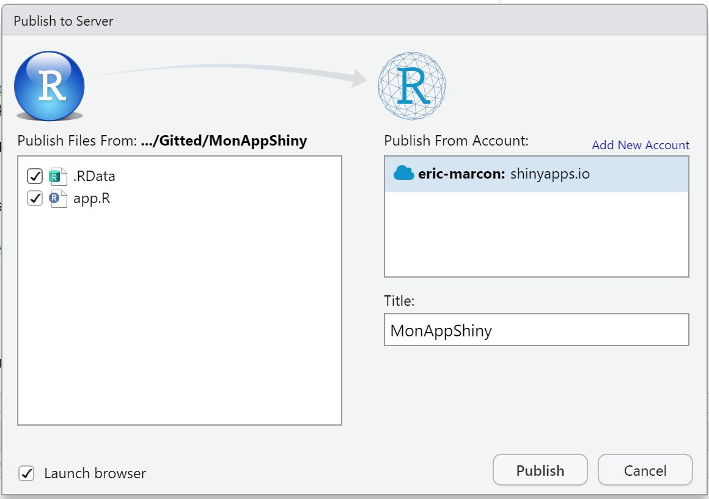

# Shiny {#chap-shiny}

\toc{1}

Shiny allows you to publish an interactive application using R code as a web site.
The site can run locally, on a user's workstation that launches it from RStudio, or online, on a dedicated server running Shiny Server[^701].

[^701]: https://rstudio.com/products/shiny/download-server/

Basically, a form allows to enter the arguments of a function and a visualization window to display the results of the calculation.

The use of a Shiny application makes the execution of the code very simple, even for users not familiar with R, but obviously limits the possibilities.


## First application

In RStudio, create an application with the menu "File > New File > Shiny Web App...", enter the name of the application "MyAppShiny" and select the folder where to put it.

The name of the application has been used to create a folder that we now need to transform into a project (project menu in the top right of RStudio, "New Project > Existing Directory", select the application folder).

The application file named `app.R` contains two functions: `ui()` which defines the GUI and `server()` which contains the R code to be executed.
The application can be launched by clicking on `Run App` in the code window.

(ref:shiny-geiser) Shiny Application *Old Faithful Geyser Data*.
```{r shiny-geiser, fig.cap="(ref:shiny-geiser)", echo=FALSE}
knitr::include_graphics('images/shiny-geiser.png')
```

The correspondence between the displayed window (figure \@ref(fig:shiny-geiser)) and the `ui()` function code is easy to see:

* the title of the application is displayed by the `titlePanel()` function;
* the slider that sets the number of bars in the histogram is created by `sliderInput()`;
* the `sidebarLayout()` function sets the layout of the page elements, `sidebarPanel` for the input controls and `mainPanel()` for the result display.

The result is displayed by the `plotOutput()` function whose argument is the name of an element of `output`, the variable filled by the `server()` function.

Any modification of an element of the interface, precisely of an element displayed by a function whose name ends with `Input()` (there are some for all types of inputs, for example `textInput()`) of **Shiny** causes `server()` to be executed and the elements of `output` to be updated.


## More elaborate application


### Working method

An application is created by choosing:

* a window layout (*layout*);
* the controls for entering parameters (*intput*);
* the controls for displaying the results (*output*).

The code to process the inputs and produce the outputs is then written to `server()`.

The RStudio tutorial[^702] is very detailed and should be used to go further.

[^702]: https://shiny.rstudio.com/tutorial/


### Example

This simple application uses the **scholar** package to query Google Scholar and get the bibliometric data of an author from his or her identifier.

The `app.R` file contains all the code and is built incrementally here.
The full application, with graphical output in addition to its simplified version presented here is available on GitHub[^703].

[^703]: https://github.com/EricMarcon/bibliometrics

The beginning of the code consists of preparing the application to run by loading the necessary packages:

```{r shiny_pkg, eval=FALSE}
# Prepare the application ####

# Load packages
library("shiny")
library("tidyverse")
```

The code of the complete application includes a function to install the missing packages, to be executed only when the application is executed on a workstation (on a server, the management of packages is not the responsibility of the application).

The user interface is as follows:

```{r UI, eval=FALSE, tidy=FALSE}
# UI ####
ui <- fluidPage(
  # Application title
  titlePanel("Bibliometrics"),
  
  sidebarLayout(
    sidebarPanel(
      helpText("Enter the Google Scholar ID of an author."),
      textInput("AuthorID", "Google Scholar ID", "4iLBmbUAAAAJ"),
      # End of input
      br(),
      # Display author's name and h
      uiOutput("name"),
      uiOutput("h")
    ),
    # Show plots in the main panel
    mainPanel(
      plotOutput("network"),
      plotOutput("citations")
    )
  )
)
```

The application window is fluid, i.e. it reorganizes itself when its size changes, and is composed of a side panel (for text input and display) and a main panel, for displaying graphics.

The elements of the side panel are:

* a help text: `helpText()`;
* a text input field, `textInput()`, whose arguments are the name, the displayed text, and the default value (an author ID);
* a line break: `br()`;
* HTML output controls: `uiOutput()`, whose single argument is the name.

The main panel contains two graphical output controls, `plotOutput()` whose argument is also the name.

The code to execute to process the inputs and produce the outputs is in the `server()` function.

```{r server, eval=FALSE, tidy=FALSE}
# Server logic ####
server <- function(input, output) {
  # Run the get_profile function only once ####
  # Store the author profile
  AuthorProfile <- reactiveVal()
  # Update it when input$AuthorID is changed
  observeEvent(input$AuthorID, 
               AuthorProfile(get_profile(input$AuthorID)))
  
  # Output ####
  output$name <- renderUI({
    h2(AuthorProfile()$name)
  })
  
  output$h <-
    renderUI({
      a(href = paste0(
        "https://scholar.google.com/citations?user=", 
        input$AuthorID),
        paste("h index:", AuthorProfile()$h_index),
        target = "_blank"
      )
    })
  
  output$citations <- renderPlot({
    get_citation_history(input$AuthorID)  %>%
      ggplot(aes(year, cites)) +
      geom_segment(aes(xend = year, yend = 0),
                   size = 1,
                   color =
                     'darkgrey') +
      geom_point(size = 3, color = 'firebrick') +
      labs(title = "Citations per year",
           caption = "Source: Google Scholar")
  })
  
  output$network <- renderPlot({
    ggplot() + geom_blank()
  })
}
```

The information needed for the output fields `$name` and `$h` (author's name and h-index) is obtained by the `get_profile()` function of the **scholar** package.
This function queries the author's Google Scholar web page and extracts the values from the result: this is a heavy processing, which is better executed only once rather than twice, in the `renderUI()` functions in charge of computing the values of `output$h` and `output$name`.

The simplest code to do this would be as follows:

```{r AuthorProfile1, eval=FALSE}
  # Run the get_profile function only once ####
  # Store the author profile
  AuthorProfile <- get_profile(input$AuthorID)
```

The difficulty with programming a Shiny application is that any computation referring to an input interface element must be *reactive*.
If the latter code were executed, the following error message would appear:
"Operation not allowed without an active reactive context. (You tried to do something that can only be done from inside a reactive expression or observer.)"

In practice, the execution of the code is started by modifying an input control (here: `intput$AuthorID`).
The code referring to one of these controls must be permanently waiting for a modification: it must therefore be placed in particular functions like `renderPlot` in the *Old Faithful Geyser Data* application or `renderUI()` here.
The following code would run without error:

```{r AuthorProfile2, eval=FALSE}
  # Output ####
  output$name <- renderUI({
    AuthorProfile <- get_profile(input$AuthorID)
    h2(AuthorProfile$name)
  })
```

The call to the value of the `input$AuthorID` control does occur in a reactive function (but `get_profile()` would have to be used a second time in the calculation of `output$h`, which we want to avoid).
The function `h2(AuthorProfile$name)` produces HTML code, a level 2 title paragraph whose value is passed as an argument.

All functions whose names begin with `render` in the **shiny** package are reactive, and each is intended to produce a different type of output, for example text (`renderText()`) or HTML code (`renderUI()`).

If code is needed to compute variables common to several output controls (`output$name` and `output$h`), it must itself be responsive.
Two functions are very useful: 

* `observeEvent()` watches for changes in an input control and executes code when they occur;
* `reactiveVal()` allows you to define a reactive variable, which will be modified by the `observeEvent()` code and will in turn cause other reactive functions that use its value to execute.

So the optimal code creates a reactive variable to store the result of the Google Scholar query in:

```{r reactiveVal, eval=FALSE}
  # Store the author profile
  AuthorProfile <- reactiveVal()
```

The reactive variable is empty at this point.
Its use is then that of a function: `AuthorProfile(x)` assigns it the value `x` and `AuthorProfile()`, without arguments, returns its value.
The `observeEvent()` function is triggered when `input$AuthorID` is modified and executes the code passed as the second argument, in this case the update of `AuthorProfile`.

```{r observeEvent, eval=FALSE}
  # Update it when input$AuthorID is changed
  observeEvent(input$AuthorID, AuthorProfile(get_profile(input$AuthorID)))
```

Finally, the `renderUI()` functions that provide output control values use the value of `AuthorProfile`:

```{r renderUI, eval=FALSE}
  # Output ####
  output$name <- renderUI({
     h2(AuthorProfile()$name)
  })
```

Note the parentheses in `AuthorProfile()`, a reactive variable, as opposed to the `AuthorProfile$name` syntax for a classic variable.

The value of `output$h` is an internet link, `<a href=...` in HTML, written by the `a()` function of the **htmltools** package used by `renderUI()`.

```{r htmltools, eval=FALSE}
  output$h <-
    renderUI({
      a(href = paste0("https://scholar.google.com/citations?user=", input$AuthorID),
        paste("h index:", AuthorProfile()$h_index),
        target = "_blank"
      )
    })
```

The link is to the author's Google Scholar page.
The value displayed is its h index.
The argument `target = "_blank"` indicates that the link should be opened in a new browser window.

The `output$citations` graph is created by the `renderPlot()` reactive function.
The data provided by the `get_citation_history()` function of **scholar** (which queries the Google Scholar API) is processed by `ggplot()`.

Finally, the `output$network` graph is an empty graph in this simplified version of the application.

The full application takes this code and adds error handling in case the author code does not exist on Google Scholar and the co-author network graph.

## Hosting {#sec:hebergement-shiny}

A Shiny application is not necessarily hosted by a web server: it can be run on users' workstations if they have R.

For a wider use, a dedicated server is necessary.
Shinyapps.io[^704] is a service from RStudio that allows to host 5 Shiny applications for free with a maximum uptime of 5 hours per month.

[^704]: https://www.shinyapps.io/

First of all, you have to open an account on the site, preferably with your GitHub identifiers.
To allow the management of online applications directly from RStudio, you must then install the **rsconnect** package and set it up:

```{r setAccountInfo, eval=FALSE}
rsconnect::setAccountInfo(name='prenom.nom',
			  token='xxx',
			  secret='<SECRET>')
```

The exact code, along with the username and token to use, are displayed on the Shinyapps.io homepage: click on "Show Secret", copy the code and paste it into the RStudio console to run it.
A "Publish" button is available just to the right of the "Run App" button.
Click on it and validate the publication (figure \@ref(fig:shiny-publish)).

(ref:shiny-publish) Publication of the Shiny application on Shinyapps.io.
```{r shiny-publish, fig.cap="(ref:shiny-publish)", echo=FALSE}

```

The application is now available at https://prenom-nom.shinyapps.io/MonAppShiny/

The "Bibliometrics" application does not work on Shinyapps.io because the way the **Scholar** package queries Google Scholar is not supported.
Most Shiny applications work without difficulty, as long as they don't require complex networking features.
